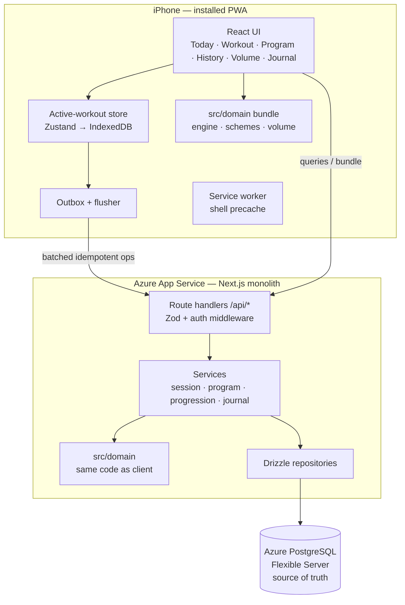

# Architecture Plan

Status: Final for MVP implementation — the entry point to the architecture package.

| Document | Purpose |
|---|---|
| `domain-model.md` | Entities, aggregates, lifecycles, mutability/snapshot rules |
| `data-model.md` | Logical relational design (Postgres) |
| `prescription-model.md` | Set/rep scheme + prescription representation |
| `progression-engine.md` | Strategy abstraction, recommendations, explainability |
| `volume-model.md` | Per-muscle volume counting, presets, RP handling |
| `pwa-offline-strategy.md` | Offline posture, sync, iOS constraints |
| `mvp-scope.md` | MVP / post-MVP / out-of-scope with acceptance criteria |
| `evidence-to-design.md` | Design decisions ↔ evidence registry mapping |
| `adr/ADR-001…009` | Consequential decision records |
| `open-decisions.md` | Deliberately unfrozen decisions with defaults |
| `implementation-plan.md` | Phased handoff plan for the coding agent |

---

## 1. Executive summary

A **single-user, mobile-first strength/hypertrophy training system**, built as a TypeScript modular monolith in one Next.js application, deployed as an installable PWA on Azure. Postgres (Azure Database for PostgreSQL) is the durable source of truth; the active workout session is local-first on the phone (IndexedDB + outbox sync) so gym logging survives dead connectivity, refreshes, and iOS process kills.

The differentiating core is a **pure, deterministic domain layer** (`src/domain`) containing the prescription model, progression/recommendation engine, and volume calculator — no framework, database, or network imports, unit-testable with plain objects, and runnable identically on server and client. Training-science humility is architectural: rules carry `evidence_supported | heuristic | user_defined` classifications, RIR is handled as a noisy integer band, RP volume landmarks are a labeled coaching preset, and no automation ships where the evidence corpus can't support it (auto-deloads, auto-MEV/MRV, precise RIR optimization).

History is inviolable: sessions snapshot their prescriptions at start; templates, strategies, and metadata can change freely without rewriting what any past workout meant.

## 2. Architecture style

**Layered modular monolith, single deployable.** No microservices, no event bus, no CQRS beyond "derived values are computed, not stored", no event sourcing. Strict one-way dependencies:

```text
src/domain    → (nothing but zod + std lib)     pure logic: schemes, engine, volume, schedule
src/server    → domain                          Drizzle repos, services, auth
src/app/api   → server                          route handlers (thin: validate → service → serialize)
src/app, src/components, src/lib → domain (types) + api client     UI, stores, outbox
```

Boundary enforced by ESLint import rules + a CI check; the progression engine physically cannot touch React or the DB.

## 3. Technical stack (single recommendation)

| Concern | Choice | One-line rationale (alternatives in ADRs) |
|---|---|---|
| Language | TypeScript, `strict` | Type safety across domain/API/UI; agent-friendly |
| Framework | Next.js 15+ (App Router), React 19 | One deployable, colocated API, best-trodden path for coding agents (ADR-002) |
| Styling | Tailwind CSS v4 | Mobile-first utility styling, no design-system overhead |
| Client data | TanStack Query + small Zustand store for active workout | Boring, composable; workout store persists to IndexedDB |
| Local storage | IndexedDB via `idb` | Active session + outbox + bundle cache (ADR-005) |
| Service worker | Serwist | Maintained next-pwa successor; precache + minimal runtime caching |
| API | REST-ish route handlers + Zod validation, thin typed client | Explicit, replayable payloads suit the offline outbox better than RPC magic |
| ORM / DB | Drizzle ORM → PostgreSQL 16 (Azure Database for PostgreSQL Flexible Server, West Europe) | SQL-first types, managed Postgres with built-in PITR backups (ADR-003/009) |
| Tests | Vitest (+ PGlite for integration), Playwright (E2E) | Real-Postgres-semantics tests without Docker |
| Auth | Single-account email+password, argon2id, iron-session cookie | Right-sized for one user (ADR-004) |
| Hosting | Azure App Service (Linux B1, Node 24, standalone Next.js output) | Lowest-ops Azure-managed host for a long-lived Node server; platform TLS; Always On (ADR-009) |
| Telemetry | Application Insights (workspace-based, default sampling) | Server-side failure visibility for the sync path at negligible cost (ADR-009) |
| IDs | UUIDv7, client-generated for offline-created rows | Idempotent sync, index-friendly |

Node 24 LTS, pnpm. No Redis, no queues, and no Azure services beyond ADR-009's minimal set (App Service, Flexible Server, Application Insights) — in particular no AKS, Functions, API Management, Service Bus, VNets, or Key Vault in MVP.

## 4. System boundaries & major components



Out of system: no third-party integrations (no Apple Health, no external APIs), no LLM services, no analytics/telemetry SaaS in MVP.

## 5. Primary data flows

1. **Plan:** user edits program/templates/blocks (online) → API → Postgres. Pure CRUD with validation.
2. **Today:** client fetches `/api/today-bundle` → server derives effective prescriptions (block week, deload modifiers, latest decisions, previous performance) via domain functions → cached in IndexedDB.
3. **Execute:** start workout → PrescriptionSnapshots frozen into a local session aggregate → every set tap writes IndexedDB + appends outbox op → flusher upserts to server whenever possible.
4. **Recommend:** session completion (server; client fallback offline) → engine evaluates per exercise → Recommendation rows → next Today bundle carries them → user Accept/Keep/Custom (often implicitly via first logged set) → Decision persisted → feeds next cycle.
5. **Observe:** dashboard/history/volume screens compute derived views on demand from Postgres; nothing derived is stored.

## 6. Security (right-sized for a personal internet-facing app)

- HTTPS everywhere (platform-enforced); HSTS.
- Auth: argon2id password hash; sealed HTTP-only `Secure` `SameSite=Lax` cookie (iron-session), 30-day rolling expiry; login rate limiting via `auth_throttle` table (DB-backed, restart-safe); registration hard-disabled once the single account exists (first-run setup creates it).
- Every API route behind auth middleware except `/login` + health; all queries scoped by `user_id`; server-side authorization on every mutation (no client-trusted ids beyond entity UUIDs validated for ownership).
- Zod validation on every request body; JSONB payloads validated against domain schemas before persistence.
- Secrets (DB URL, session secret) only in platform env vars; none in the repo or client bundle.
- Backups: Flexible Server automated backups with 7-day PITR (built in) + weekly `pg_dump` GitHub Action artifact + user-triggered JSON export endpoint (data ownership).
- Explicitly rejected as over-engineering: RBAC, audit logs, WAF, field-level encryption, compliance tooling.

## 7. Source-of-truth vs derived data (normative)

| Data | Class | Persisted? |
|---|---|---|
| SetLog, WorkoutSession(+SessionExercise incl. snapshots) | **Source of truth** | yes |
| Bodyweight/Recovery entries | Source of truth | yes |
| Recommendation **Decision** (user choice) | Source of truth | yes |
| Program/template/block/exercise/preset definitions | Source of truth (mutable definitions) | yes |
| Recommendation output (action/target/reasons/inputs) | Derived, **persisted for auditability only** — clearly separated from the accepted change (the Decision) | yes |
| Weekly volume, rolling bodyweight averages, trends, e1RM, block week, completion stats, dashboard highlights | Derived | **no — computed on read** |

Rule: anything recomputable from facts is recomputed; the only derived rows we keep are recommendation records, because their explanation + the attached decision are longitudinal data the user actually owns.

## 8. Deployment & operations

- Git repo (to be initialized) → GitHub → GitHub Actions deploy to Azure App Service via OIDC federated credentials (`azure/webapps-deploy`); no preview deployments (accepted loss vs. Vercel — ADR-009).
- CI (GitHub Actions): typecheck, lint (incl. boundary rules), unit + integration (PGlite), build; Playwright smoke on demand/nightly.
- Environments: local (`.env.local`, Docker Postgres 16), production (App Service App Settings). Two, not three.
- Migrations: drizzle-kit generated SQL, committed, applied by a CI release step (`drizzle-kit migrate` against production) before each App Service deployment.
- Azure resources (resource group, Flexible Server, App Service, federated credential) are human-provisioned once and documented in the repo — no IaC for four resources (ADR-009).
- Runbook-level ops only: restore = Flexible Server PITR or `pg_dump` artifact; incident tooling = Application Insights + App Service log stream.

## 9. Key tradeoffs accepted

| Decision | Cost accepted | Why it's right here |
|---|---|---|
| One Next.js app instead of split SPA+API | Some server/client mental overhead in one codebase | One deploy, one dev server, best agent ergonomics (ADR-002) |
| Managed Postgres over SQLite-on-VPS | A cloud dependency | Zero ops + real backups beat file simplicity for durable personal data (ADR-003) |
| Online-only definition editing | Can't tweak templates offline | Collapses sync to append-mostly facts; kills conflict complexity (ADR-005) |
| LWW conflict policy | Theoretical lost update across two offline devices | Single user; DB-enforced single in-progress session; honest takeover UX |
| Snapshot-on-use JSONB over versioned definition tables | Can't SQL-query "all sessions using template v3" | History integrity with 10× less machinery; snapshots are self-describing (ADR-007) |
| Volume uses current contribution convention (no snapshots) | Editing weights re-reads all history | Uniform convention keeps trends comparable — the actual point of volume (ADR-007) |
| Recommendations persisted despite being derived | Storage + supersede bookkeeping | Explainability audit + Decision capture is core product value (ADR-006) |
| No rules-engine/DSL | New scheme/strategy types need a code change | Versioned code + config data is simpler, testable, and sufficient (ADR-006/008) |

## 10. Explicit non-goals

Social/multi-user features, coach marketplace, subscriptions/payments, exercise videos/tutorials, public profiles, multi-tenancy, RBAC, Apple Health / wearable integrations, LLM features, ML personalization, auto-deload/auto-MRV algorithms (evidence-blocked: GAP-01/02/05), notifications/push, Android-specific work, native app wrappers, i18n (English-only MVP; codes-not-prose keeps the door open), lb display units (kg only in MVP).

## 11. Architecture evaluation (against brief §39)

- **Domain representability** — 5×5 (`fixed`), 3×8–12 (`repRange`), load/rep progression (registry strategies), later double progression (config flag), target + reported RIR (band + nullable int), block lengths 1–16 wks, scheduled/manual deloads (config + overrides), ad-hoc exercises (`source: adhoc`), per-muscle volume w/ fractional sets (contribution rows), custom exercises, historical sessions — all without schema rewrites. ✅
- **History** — template/rule/metadata/contribution changes leave sessions interpretable via snapshots + identity policy (+ documented current-convention choice for volume). ✅
- **Science** — three-tier classification on strategies, configs, presets; evidence refs on presets; unsafe inferences from the registry mapped in `evidence-to-design.md`. ✅
- **Progression** — "what next / why / which rule / what did I choose" = Recommendation{target, reasonCodes+inputs, strategyId+version+config, decision}. ✅
- **UX** — prefilled weight/reps/RIR steppers; logging a set = one tap on the happy path (implicit accept); previous performance inline. ✅
- **Offline** — active workout survives connection loss, refresh, backgrounding, browser restart (IndexedDB-first writes; §10 walkthrough in `pwa-offline-strategy.md`). ✅
- **Engineering** — engine is pure TS: unit-testable without browser/DB/network (enforced by import boundaries). ✅
