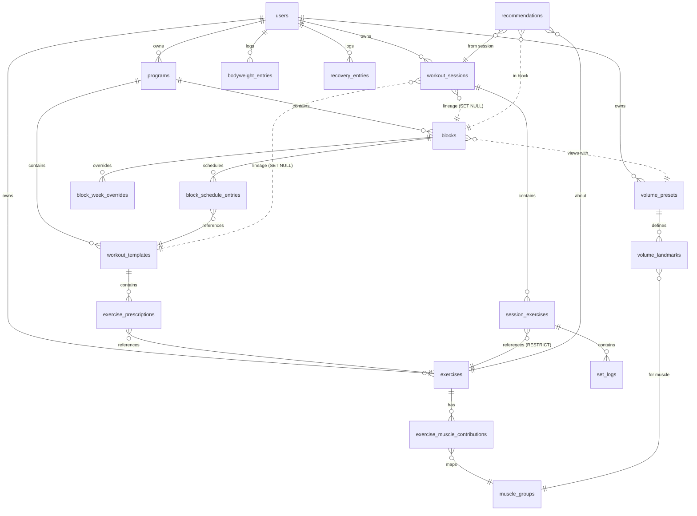

# Data Model (Logical Relational Design)

Status: Final for MVP implementation. Target: PostgreSQL 16+ (Azure Database for PostgreSQL Flexible Server), Drizzle ORM. Companions: `domain-model.md`, `adr/ADR-003-persistence.md`, `adr/ADR-007-historical-integrity.md`.

No migration code here — this is the logical design the implementation agent turns into Drizzle schema + generated migrations in Phase 0–2.

---

## 1. Global conventions

- **Primary keys:** `uuid` — client-generated **UUIDv7** for rows that can be created offline (`workout_sessions`, `session_exercises`, `set_logs`, `recommendations`); server-generated UUIDv7 elsewhere. UUIDv7 keeps b-tree indexes append-friendly.
- **Timestamps:** `created_at`, `updated_at` (`timestamptz`, UTC) on every table; `updated_at` maintained in the repository layer (not triggers). Day-keyed tables additionally carry a `date` column representing the **user-timezone local date**.
- **`user_id`:** present on all top-level aggregates (cheap future-proofing for multi-device/user; no RBAC, no tenancy machinery). Every query is scoped by it.
- **Soft delete:** `archived_at timestamptz null` pattern for definitions users "delete" but history references (`exercises`, `programs`, `workout_templates`, `volume_presets`). True row deletion for user-owned facts (`set_logs`, `bodyweight_entries`, `recovery_entries`) and for definitions with no historical references (service-layer check + FK `RESTRICT` as backstop). No tombstone tables — single writer makes them unnecessary (see `pwa-offline-strategy.md` §sync).
- **JSONB policy:** JSON where the shape is polymorphic and owned/validated by versioned domain code (schemes, snapshots, strategy configs, modifiers, recommendation payloads). Normal columns wherever we filter, join, aggregate, or constrain. Every JSONB column's shape is defined by a Zod schema in `src/domain`; the DB treats it as opaque.
- **Numeric domains:** weights `numeric(6,2)` kg; contribution weights `numeric(3,2)`; reps/RIR/small ints `smallint`. No floats for anything user-entered.
- **Naming:** snake_case tables/columns; singular id + `_id` FKs; check constraints named `ck_*`, unique `uq_*`, indexes `ix_*`.

---

## 2. Tables

### 2.1 `users`
Single-account auth + settings (one row in practice; schema doesn't care).

| Column | Type | Constraints |
|---|---|---|
| id | uuid | PK |
| email | citext | `uq_users_email` |
| password_hash | text | not null (argon2id) |
| timezone | text | not null, default `'Europe/Ljubljana'` |
| week_starts_on | smallint | not null default 1, ck in (0..6) |
| default_volume_preset_id | uuid | FK → volume_presets, null, `ON DELETE SET NULL` |
| created_at / updated_at | timestamptz | |

### 2.2 `auth_throttle`
Login rate limiting (fixed-window, restart-safe because state is in the DB, not process memory).

| Column | Type | Constraints |
|---|---|---|
| identifier | text | PK (email or IP) |
| failure_count | smallint | not null default 0 |
| window_started_at | timestamptz | not null |
| locked_until | timestamptz | null |

### 2.3 `muscle_groups`
Seeded reference data — vocabulary v2 (ADR-010): 18 rows = 17 leaves + the `back` rollup. Upserted from the domain constant on every deploy (`display_name`, `position`, `kind` synced); rows are never deleted.

| Column | Type | Constraints |
|---|---|---|
| id | text | PK — slug (`chest`, `lats`, `upper_back`, …, `back`; see `domain-model.md` §2) |
| display_name | text | not null |
| position | smallint | not null (stable display order) |
| kind | text | not null default `'muscle'`, ck in (`'muscle'`, `'rollup'`) — `'rollup'` only for `back`; rollup membership (`back → lats, upper_back`) is a domain constant, deliberately not a table or `parent_id` |

### 2.4 `exercises`

| Column | Type | Constraints |
|---|---|---|
| id | uuid | PK |
| user_id | uuid | FK → users, not null |
| name | text | not null |
| equipment | text | not null, ck in ('barbell','dumbbell','machine','cable','bodyweight','other') |
| movement_pattern | text | null (free slug) |
| mechanics | text | not null, ck in ('compound','isolation') |
| laterality | text | not null default 'bilateral', ck in ('bilateral','unilateral') |
| load_step_kg | numeric(4,2) | not null, ck > 0, default by equipment |
| strength_estimate | text | not null default 'auto', ck in ('auto','off') — e1RM disable-only override |
| measurement_profile | text | not null default 'load_reps', ck in ('load_reps','reps','load_distance','distance_time','duration','load_duration') |
| load_basis | text | null default 'unspecified', ck null or in ('total','per_hand','assistance','unspecified') — required exactly when `measurement_profile` has load (`ck_exercises_load_basis_presence`) |
| volume_counting | text | not null default 'auto', ck in ('auto','off') — profile-dependent default at create (`'off'` for `reps`), not a column default |
| is_seeded | boolean | not null default false |
| notes | text | null |
| archived_at | timestamptz | null |
| created_at / updated_at | timestamptz | |

Indexes/constraints: `uq_exercises_active_name` — unique `(user_id, lower(name))` **partial** `WHERE archived_at IS NULL` (allows re-using a name after archiving); `uq_exercises_id_profile` — unique `(id, measurement_profile)`, the target of `session_exercises`' mirror FK below.

`measurement_profile` is locked once the exercise is referenced by any `session_exercises` or `exercise_prescriptions` row (`409 measurement_profile_locked`; a service rule for the `exercise_prescriptions` half, and the mirror FK enforces the `session_exercises` half at the database level). `load_basis` is **never** locked — it stays ordinary editable metadata with history at any time, like `equipment`, both before and after the profile locks. `volume_counting` and `strength_estimate` are likewise ordinary editable metadata. The three new columns' defaults are kept **permanently**, not dropped after backfill, for rollback safety (an older build's insert with the column default must always read as a real, self-consistent row).

**Seeded reconcile outcomes, Release 2 (`src/db/seed/reconcileMeasurementProfiles.ts`, athletic-measurement-profiles §14.3, O-5):** shipped, not proposed. On an existing database, the Release-2 seed step reconciles seeded rows by predicate: the assisted pull-up (`machine-assisted-pull-up`) gains `load_basis = 'assistance'`; the seeded Plank (`bodyweight-plank`) and Farmer's Carry (`dumbbell-farmers-carry`) each convert to their shaped profile (`duration`, and `load_distance` / `per_hand` respectively) **only while unreferenced** by any `session_exercises` or `exercise_prescriptions` row — this unreferenced conversion also sets `volume_counting = 'off'` for the carry (L-6, 2026-09-08), matching a fresh seed of the same catalog entry exactly; a **referenced** Farmer's Carry or Plank instead gets `volume_counting = 'off'` on its own (L-5 for the Plank, 2026-09-08), leaving its profile untouched (its history stays `load_reps` forever, frozen — converting a referenced row's profile would be destructive reinterpretation; the fabricated reps that profile leaves behind just stop counting as hypertrophy volume). Deterministic, idempotent, state-predicated — a clean-database seed on Release 2 inserts all three catalog entries already correctly shaped instead (`exerciseCatalog.ts`), so the reconcile finds nothing to do.

### 2.5 `exercise_muscle_contributions`

| Column | Type | Constraints |
|---|---|---|
| exercise_id | uuid | FK → exercises `ON DELETE CASCADE` |
| muscle_group_id | text | FK → muscle_groups `ON DELETE RESTRICT` |
| role | text | not null, ck in ('primary','secondary') |
| weight | numeric(3,2) | not null, ck `> 0 AND <= 1` |
| updated_at | timestamptz | |

PK `(exercise_id, muscle_group_id)`. Service-level invariant: ≥1 primary row per exercise. (CASCADE is safe: exercises with history are archive-only, enforced by RESTRICT FKs from history tables.)

**Leaf-only rule (ADR-010):** the service accepts a *new* contribution row only for groups with `kind = 'muscle'`. A row on a rollup group can exist only as a legacy direct contribution (a pre-v2 `back` row on a user-created exercise, or a reported reconciliation conflict) and may be carried through an update unchanged, edited, removed, or reclassified to a leaf — never newly created. Enforced in `src/server/exercises` with integration coverage, not as a DB constraint (it would need a join on `muscle_groups.kind`).

**Seeded-row reconciliation (ADR-010):** seeded `back` rows are re-pointed to `lats`/`upper_back` by the seed pipeline, not by a SQL migration — catalog slugs are not persisted here, so the step derives each seeded id in application code (`seededExerciseId(userId, slug)`) and runs a conditional update restricted to `exercises.is_seeded = true`, `muscle_group_id = 'back'`, and no existing row on the target leaf. `role` and `weight` are never touched; `updated_at` is set. Idempotent by state (zero rows on every later run), no ledger.

### 2.6 `programs`

| Column | Type | Constraints |
|---|---|---|
| id | uuid | PK |
| user_id | uuid | FK, not null |
| name | text | not null |
| description | text | null |
| status | text | not null default 'active', ck in ('active','archived') |
| archived_at | timestamptz | null |
| created_at / updated_at | timestamptz | |

`uq_programs_one_active` — unique `(user_id)` partial `WHERE status = 'active'`.

### 2.7 `workout_templates`

| Column | Type | Constraints |
|---|---|---|
| id | uuid | PK |
| program_id | uuid | FK → programs `ON DELETE CASCADE` |
| name | text | not null |
| position | smallint | not null |
| notes | text | null |
| archived_at | timestamptz | null |
| created_at / updated_at | timestamptz | |

`uq_templates_active_name` — unique `(program_id, lower(name))` partial `WHERE archived_at IS NULL`.

### 2.8 `exercise_prescriptions`

| Column | Type | Constraints |
|---|---|---|
| id | uuid | PK |
| template_id | uuid | FK → workout_templates `ON DELETE CASCADE` |
| exercise_id | uuid | FK → exercises `ON DELETE RESTRICT` |
| position | smallint | not null |
| scheme | jsonb | not null — versioned SetScheme (`prescription-model.md`) |
| target_rir | jsonb | null — `{min:int, max:int}` |
| baseline_load_kg | numeric(6,2) | null, ck `>= 0` |
| rest_seconds | smallint | null, ck `> 0` |
| progression | jsonb | not null — `{strategyId, config, classification}` |
| notes | text | null |
| created_at / updated_at | timestamptz | |

`uq_prescriptions_position` — unique `(template_id, position)` **deferrable initially deferred** (reordering swaps in one tx).

### 2.9 `blocks`

| Column | Type | Constraints |
|---|---|---|
| id | uuid | PK |
| program_id | uuid | FK → programs `ON DELETE CASCADE` |
| name | text | not null |
| sequence | smallint | not null |
| goal | text | not null default 'hypertrophy', ck in ('hypertrophy','strength','general') |
| start_date | date | not null |
| weeks_planned | smallint | not null, ck between 1 and 16 |
| status | text | not null default 'planned', ck in ('planned','active','completed','abandoned') |
| volume_preset_id | uuid | FK → volume_presets `ON DELETE SET NULL`, null |
| deload | jsonb | null — DeloadConfig |
| planned_progression | jsonb | null — reserved (post-MVP content) |
| notes | text | null |
| completed_at | timestamptz | null |
| created_at / updated_at | timestamptz | |

`uq_blocks_one_active` — unique `(program_id)` partial `WHERE status = 'active'`; `uq_blocks_sequence` — unique `(program_id, sequence)`.

### 2.10 `block_schedule_entries`

| Column | Type | Constraints |
|---|---|---|
| id | uuid | PK |
| block_id | uuid | FK → blocks `ON DELETE CASCADE` |
| template_id | uuid | FK → workout_templates `ON DELETE RESTRICT` |
| position | smallint | not null |
| weekdays | smallint[] | null — ISO weekday ints 1–7; null ⇒ rotation mode |

`uq_schedule_position` — unique `(block_id, position)` deferrable. RESTRICT on template blocks archiving/deleting a scheduled template.

### 2.11 `block_week_overrides`

| Column | Type | Constraints |
|---|---|---|
| id | uuid | PK |
| block_id | uuid | FK → blocks `ON DELETE CASCADE` |
| week_index | smallint | not null, ck `>= 1` |
| type | text | not null, ck in ('deload','custom') |
| modifiers | jsonb | not null — WeekModifiers |
| note | text | null |
| created_at / updated_at | timestamptz | |

`uq_week_override` — unique `(block_id, week_index)`.

### 2.12 `workout_sessions`  *(history — client-generated ids)*

| Column | Type | Constraints |
|---|---|---|
| id | uuid | PK (client UUIDv7) |
| user_id | uuid | FK, not null |
| block_id | uuid | FK → blocks `ON DELETE SET NULL`, null — lineage only |
| template_id | uuid | FK → workout_templates `ON DELETE SET NULL`, null — lineage only |
| template_name | text | null — snapshot |
| week_index | smallint | null — snapshot |
| is_deload | boolean | not null default false — snapshot |
| status | text | not null default 'in_progress', ck in ('in_progress','completed','discarded') |
| started_at | timestamptz | not null (client clock) |
| completed_at | timestamptz | null |
| client_id | text | null — device identifier for diagnostics |
| notes | text | null |
| created_at / updated_at | timestamptz | server receipt times |

Indexes: `uq_sessions_one_in_progress` — unique `(user_id)` partial `WHERE status = 'in_progress'`; `ix_sessions_user_started` `(user_id, started_at DESC)`; `ix_sessions_block` `(block_id, started_at)`.

`SET NULL` on block/template deletion is safe **because interpretation never depends on those FKs** — snapshots carry the meaning (ADR-007).

### 2.13 `session_exercises`

| Column | Type | Constraints |
|---|---|---|
| id | uuid | PK (client UUIDv7) |
| session_id | uuid | FK → workout_sessions `ON DELETE CASCADE` |
| exercise_id | uuid | FK → exercises `ON DELETE RESTRICT` |
| position | smallint | not null |
| source | text | not null, ck in ('template','adhoc') |
| prescription | jsonb | null — PrescriptionSnapshot (null for free ad-hoc) |
| measurement_profile | text | not null default 'load_reps', ck in ('load_reps','reps','load_distance','distance_time','duration','load_duration') — frozen at insert, never updated |
| load_basis | text | null default 'unspecified', ck null or in ('total','per_hand','assistance','unspecified') — frozen at insert; not locked by any constraint (§10.3 of the profiles evaluation keeps the exercise-level basis editable) |
| skipped | boolean | not null default false |
| notes | text | null |
| created_at / updated_at | timestamptz | |

`uq_session_exercise_position` — unique `(session_id, position)` deferrable; `ix_session_exercises_exercise` `(exercise_id, created_at DESC)` — powers "previous performance" and engine history lookups; `uq_session_exercises_id_profile` — unique `(id, measurement_profile)`, the target of `set_logs`' composite FK below; `fk_session_exercises_exercise_profile` — composite FK `(exercise_id, measurement_profile)` → `exercises(id, measurement_profile)` `ON DELETE RESTRICT` (the "mirror FK": proves at the database level that a slot's frozen profile equals its exercise's profile at write time, and makes `exercises.measurement_profile` unchangeable once any slot references it).

### 2.14 `set_logs`

| Column | Type | Constraints |
|---|---|---|
| id | uuid | PK (client UUIDv7) |
| session_exercise_id | uuid | FK → session_exercises `ON DELETE CASCADE` |
| set_number | smallint | not null, ck `>= 1` |
| is_warmup | boolean | not null default false |
| weight_kg | numeric(6,2) | null, ck `>= 0` (0 = bodyweight-only) — NOT NULL dropped; required only for load profiles, enforced by `ck_set_logs_profile_shape` |
| reps | smallint | null, ck between 1 and 100 — NOT NULL dropped; required only for rep profiles, enforced by `ck_set_logs_profile_shape` |
| rir | smallint | null, ck between 0 and 10 |
| distance_m | numeric(7,2) | null, ck `> 0 and <= 99999.99` |
| duration_s | numeric(7,2) | null, ck `> 0 and <= 86400` |
| measurement_profile | text | not null default 'load_reps' — copied from the parent slot at insert, never updated; **no separate enum CHECK**: membership is enforced transitively by `ck_set_logs_profile_shape`'s OR-chain (an unknown value matches no branch) and by the composite FK below |
| logged_at | timestamptz | not null (client clock) |
| notes | text | null |
| created_at / updated_at | timestamptz | |

`uq_set_number` — unique `(session_exercise_id, set_number)` deferrable initially deferred (renumbering after mid-list delete); `ix_set_logs_session_exercise` `(session_exercise_id, set_number)`; `fk_set_logs_parent_profile` — composite FK `(session_exercise_id, measurement_profile)` → `session_exercises(id, measurement_profile)` `ON DELETE CASCADE` (a set's profile always equals its parent slot's, and the parent's `measurement_profile` cannot change while child rows exist); `ck_set_logs_profile_shape` — a single per-profile CHECK over `weight_kg`/`reps`/`distance_m`/`duration_s`/`rir` nullability (six profile branches; see `athletic-measurement-profiles-architecture-evaluation.md` §8.3 for the exact predicate).

### 2.15 `recommendations`

| Column | Type | Constraints |
|---|---|---|
| id | uuid | PK (client-generatable) |
| user_id | uuid | FK, not null |
| exercise_id | uuid | FK → exercises `ON DELETE RESTRICT` |
| block_id | uuid | FK → blocks `ON DELETE SET NULL`, null |
| source_session_id | uuid | FK → workout_sessions `ON DELETE CASCADE` |
| source_session_exercise_id | uuid | FK → session_exercises `ON DELETE CASCADE` |
| strategy_id | text | not null |
| strategy_version | smallint | not null |
| classification | text | not null, ck in ('evidence_supported','heuristic','user_defined') |
| config | jsonb | not null — config snapshot |
| inputs | jsonb | not null — InputsSummary |
| action | text | not null, ck in ('increase_load','decrease_load','hold','increase_reps','none') |
| target | jsonb | null — `{loadKg?, reps?}` |
| reason_codes | text[] | not null |
| confidence | text | not null, ck in ('low','medium','high') |
| computed_by | text | not null, ck in ('server','client') |
| decision_status | text | not null default 'pending', ck in ('pending','accepted','modified','rejected','superseded') |
| decision_chosen | jsonb | null — `{loadKg?, reps?}` |
| decided_at | timestamptz | null |
| decision_source | text | null, ck in ('explicit','implicit_first_set') |
| created_at / updated_at | timestamptz | |

Indexes: `ix_recs_exercise` `(exercise_id, created_at DESC)`; `ix_recs_pending` partial `(user_id) WHERE decision_status = 'pending'`; `uq_recs_one_pending` — unique `(exercise_id, coalesce(block_id, '00000000-…'))` partial `WHERE decision_status = 'pending'` (supersede-before-insert makes this hold).

Decision columns are embedded (not a separate table): strictly 0..1 decision per recommendation, appended once — a second table would be joins without integrity gain.

### 2.16 `volume_presets`

| Column | Type | Constraints |
|---|---|---|
| id | uuid | PK |
| user_id | uuid | FK, null (null ⇒ builtin seed) |
| name | text | not null |
| description | text | null |
| classification | text | not null, ck in ('evidence_supported','heuristic','user_defined') |
| source_ref | text | null — e.g. `docs/input/rp-volume-landmarks.md` |
| evidence_refs | text[] | null — registry IDs |
| is_builtin | boolean | not null default false |
| archived_at | timestamptz | null |
| created_at / updated_at | timestamptz | |

### 2.17 `volume_landmarks`

| Column | Type | Constraints |
|---|---|---|
| id | uuid | PK |
| preset_id | uuid | FK → volume_presets `ON DELETE CASCADE` |
| muscle_group_id | text | FK → muscle_groups `ON DELETE RESTRICT` |
| key | text | not null — `'mv','mev','mav','mrv',…` (free vocabulary) |
| value_min | numeric(5,1) | null, ck `>= 0` |
| value_max | numeric(5,1) | null, ck `>= value_min` when both set |
| open_ended | boolean | not null default false |
| note | text | null |

`uq_landmark` — unique `(preset_id, muscle_group_id, key)`. ck: at least one of value_min/value_max not null.

A landmark may reference a rollup row: the RP "Back" row attaches to `back` (`kind = 'rollup'`). Seeding never writes landmarks for a rollup's member leaves (`lats`, `upper_back`) — that would double-count the Back band — nor for `forearms`, `lower_back`, `adductors`, for which RP has no row (volume-model §4). A seed rule and UI rule, not a constraint: users may add their own landmark rows to any group.

### 2.18 `bodyweight_entries`

| Column | Type | Constraints |
|---|---|---|
| id | uuid | PK (client-generatable) |
| user_id | uuid | FK, not null |
| date | date | not null — user-local date |
| weight_kg | numeric(5,2) | not null, ck between 20 and 400 |
| note | text | null |
| created_at / updated_at | timestamptz | |

`uq_bodyweight_day` — unique `(user_id, date)`.

### 2.19 `recovery_entries`

| Column | Type | Constraints |
|---|---|---|
| id | uuid | PK (client-generatable) |
| user_id | uuid | FK, not null |
| date | date | not null |
| sleep_hours | numeric(4,2) | null, ck between 0 and 24 |
| sleep_quality | smallint | null, ck between 1 and 5 |
| readiness | smallint | null, ck between 1 and 5 |
| soreness | smallint | null, ck between 1 and 5 |
| note | text | null |
| created_at / updated_at | timestamptz | |

`uq_recovery_day` — unique `(user_id, date)`; ck: at least one metric column not null.

### 2.20 `dashboard_estimate_selections`

Metrics dashboard v1 (`docs/reviews/metrics-dashboard-architecture-evaluation.md` §11.5, migration `0012`) — the feature's one write path. Dashboard *configuration* only (which of the athlete's estimated-1RM-tracker-compatible exercises the Current estimates card shows, and in what order); never a fact, snapshot, or derived value — no column stores an estimate, a name, or an eligibility flag.

| Column | Type | Constraints |
|---|---|---|
| user_id | uuid | FK → users, `ON DELETE CASCADE`, not null |
| exercise_id | uuid | FK → exercises, `ON DELETE CASCADE`, not null |
| position | smallint | not null, ck between 1 and 5 |
| created_at / updated_at | timestamptz | |

Primary key `(user_id, exercise_id)` — no `id` column, the pair is the identity, like `exercise_muscle_contributions`. `uq_dashboard_estimate_selections_position` — unique `(user_id, position)`; combined with the check constraint, more than five rows per user is impossible at the database level. Rows are never created by the seed or by account setup — the initial state is empty for every account.

---

## 3. ER diagram

Dotted = nullable lineage/context references whose loss never changes historical meaning.

---

## 4. Historical snapshot strategy (schema view)

| History concern | Mechanism |
|---|---|
| Template edited after sessions logged | `session_exercises.prescription` JSONB snapshot; template FK is lineage-only `SET NULL` |
| Template/block deleted | `SET NULL` FKs + `template_name`/`week_index`/`is_deload` snapshot columns |
| Exercise deleted | impossible with history (`RESTRICT` from session_exercises, prescriptions, recommendations) — archive instead |
| Exercise renamed | intended behavior: history shows current name (identity policy, `domain-model.md` §3) |
| Strategy code evolves | `recommendations.strategy_version` + frozen `config`/`inputs`; prescriptions pin no version (always current), snapshots record what ran |
| Contribution weights edited | deliberately re-interprets derived volume everywhere (`volume-model.md` §3); facts untouched |
| Muscle taxonomy v2 reconciliation (seeded `back` → `lats` / `upper_back`) | same policy: leaf series are re-interpreted uniformly for all history; the `back` rollup total is exactly preserved for every week (ADR-010 sum-preservation invariant); facts untouched |
| Preset/landmark edits | display-only data; nothing historical references it |

## 5. Derived data — explicitly not persisted

Weekly volume aggregates (leaf series, rollup totals and the `unclassifiedBack` term alike), rolling bodyweight averages, e1RM/trend series, block "current week", completion percentages, dashboard highlights. All are pure functions over the tables above; persisting them would create consistency liabilities with zero read-performance need at single-user scale. The only persisted derived artifact is `recommendations` — kept for auditability and because its Decision is source-of-truth user data (`architecture-plan.md` §7).

## 6. Sizing sanity check

Heavy user ≈ 5 sessions/week × 8 exercises × 5 sets ≈ 10k set rows/year — trivial for Postgres at any horizon. No partitioning, no archival jobs, no read models. Indexes above are sufficient; revisit only with measured evidence.
