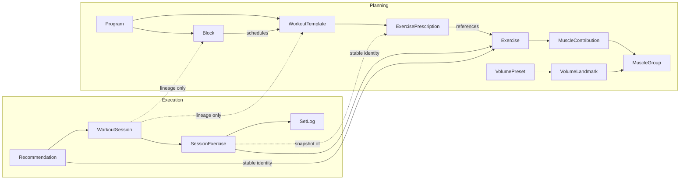
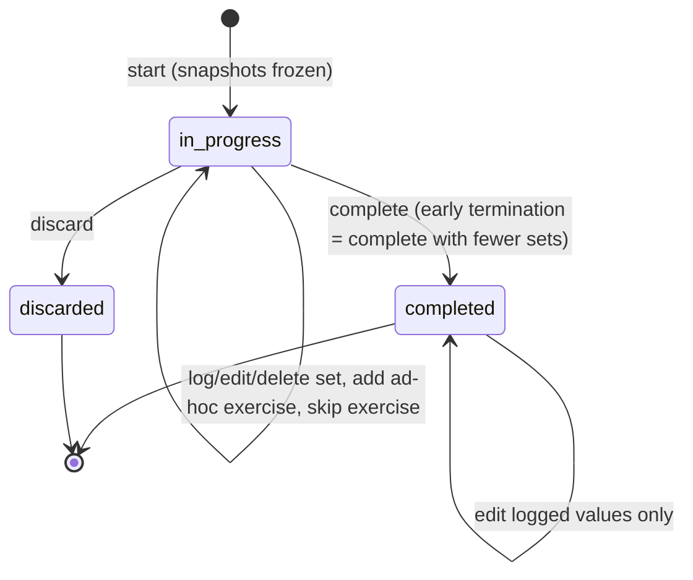

# Domain Model

Status: Final for MVP implementation. Companion documents: `data-model.md` (relational mapping), `prescription-model.md`, `progression-engine.md`, `volume-model.md`.

This document defines the domain concepts, their relationships, lifecycles, invariants, and — critically — which concepts are **mutable definitions** and which are **immutable historical records**. That split is the backbone of the whole design (see `adr/ADR-007-historical-integrity.md`).

---

## 1. Overview

Two worlds, one boundary:

```text
PLANNING WORLD (mutable definitions)          EXECUTION WORLD (historical facts)
─────────────────────────────────             ──────────────────────────────────
Exercise (+ MuscleContributions)              WorkoutSession
Program                                       SessionExercise (+ PrescriptionSnapshot)
WorkoutTemplate                               SetLog
ExercisePrescription                          Recommendation (+ Decision)
Block (+ Schedule, WeekOverrides)             BodyweightEntry
VolumePreset (+ VolumeLandmarks)              RecoveryEntry
ProgressionStrategy (code, versioned)
```

The rule that connects them: **crossing from planning to execution always copies, never references live.** When a workout session starts, the relevant slice of the planning world (prescription, targets, strategy config, block context) is snapshotted into the session. Later edits to templates, exercises, presets, or strategies never change what a historical session means.

One deliberate exception: **muscle contribution weights are not snapshotted** — per-muscle volume is a derived interpretation recomputed under the current convention, not a historical fact. Rationale in §8 and `volume-model.md`.



---

## 2. Reference data

### MuscleGroup
Seeded reference entity (not a hard-coded enum) so groups can be added later without schema change. Vocabulary v2 (ADR-010, accepted 2026-08-23) — **17 leaves + 1 rollup**:

- `kind: 'muscle' | 'rollup'`. A **leaf** (`kind = 'muscle'`) is a tracking bucket that contributions target. A **rollup** (`kind = 'rollup'`) is an analytical region whose totals are derived from its member leaves; it exists so that coarse reference data (RP's "Back" landmarks) has an honest anchor. Rollup membership is a domain constant in `src/domain/exercises/muscleGroups.ts` (`back → [lats, upper_back]`), not a table and not a `parent_id` — there is exactly one rollup and no hierarchy.
- Leaves (stable text slugs): `chest`, `lats`, `upper_back`, `front_delts`, `side_delts`, `rear_delts`, `traps`, `biceps`, `triceps`, `forearms`, `abs`, `quads`, `hamstrings`, `glutes`, `adductors`, `calves`, `lower_back`.
- Rollup: `back` ("Back") = `lats` + `upper_back` (+ any legacy direct `back` contributions — §3, §8). `traps`, `rear_delts` and `lower_back` are *not* members: RP lists Traps and Rear/Side Delts separately and has no erector row, so those leaves stand alone.
- Naming conventions (display copy, documented because the vocabulary is a training heuristic, not anatomy): `upper_back` = rhomboids / mid- and lower-trapezius region ("Upper Back"); `traps` = upper-trapezius shrug work ("Traps"); `lower_back` = the spinal-erector / lower-back tracking bucket, displayed as **"Lower Back (Erectors)"** — the slug is retained unchanged. Display sections on screens (Back, Legs, Arms & Shoulders, Torso) are UI ordering only (`position`), never data.
- History of the split: `back` was a single leaf through Phase 5.5 (matching RP granularity). The split into `lats`/`upper_back` was **not purely additive**, contrary to what this section previously claimed: adding the leaves is additive, but re-pointing existing `back` contributions is a real reconciliation of data (ADR-010), performed in application code by deterministic seeded id with role and weight preserved. What *is* preserved exactly is the rollup's historical total (ADR-010 sum-preservation invariant).
- Mutation rules: add-only (deletions never — history interpretation may depend on any group); `kind` is immutable once seeded; a rollup never becomes a leaf or vice versa. Muscle groups beyond vocabulary v2 require an ADR amendment, not a seed edit.

---

## 3. Exercise library

### Exercise (aggregate root)
Definition of a movement, owned by the user (seeded set + custom).

Properties: `name`, `equipment` (barbell | dumbbell | machine | cable | bodyweight | other), `movementPattern` (optional: horizontal_push, vertical_pull, squat, hinge, …), `mechanics` (compound | isolation), `laterality` (bilateral | unilateral), `loadStepKg` (smallest sensible load increment; defaults by equipment, e.g. 2.5 barbell, 2.0 dumbbell), `notes`, `archivedAt`.

### MuscleContribution (child of Exercise)
`{ muscleGroupId, role: primary | secondary, weight: 0 < w ≤ 1 }`

- Defaults: primary → 1.0, secondary → 0.5. The 0.5 is a **labeled heuristic convention** (EVIDENCE-004: best-fitting statistical convention, not a biological constant) and is stored per row so it can be tuned per exercise later without schema change.
- Invariant: at least one `primary` contribution per exercise; one row per (exercise, muscle).
- **Leaf-only rule (vocabulary v2):** new contribution rows target leaf groups only. A rollup slug is rejected on create; on update it is accepted only as a *carry-through* of a row that already exists on that exercise (the update path replaces the whole contribution list, so a legacy row must be able to pass through unchanged). A legacy direct-rollup row is therefore never created, but may be kept, edited in weight/role, removed, or reclassified to a leaf — and is always visible in the editor with an explicit reclassify affordance. Nothing infers a leaf on the user's behalf.
- Seeded defaults **partition** the rollup: every seeded `back` row maps to exactly one of `lats` / `upper_back` (authoritative mapping table in ADR-010); no sibling secondaries are added by default. A user may add them, accepting that the rollup then exceeds RP-style "one set per exercise" counting (§8).

### Exercise identity policy (important invariant)
- The exercise id is a **stable identity for a movement**. Renaming (“Bench Press” → “Barbell Bench Press”) is allowed: history displays the current name.
- **Repurposing is forbidden by convention** (UI copy + docs): changing an exercise into a *different movement* would silently change the meaning of history. The correct action is: archive the old exercise, create a new one.
- Exercises referenced by any historical session can never be deleted — only archived (hidden from pickers, retained everywhere else).
- Contribution weight edits are allowed and re-interpret volume history uniformly (see §8).

Lifecycle: `active → archived` (reversible).

---

## 4. Program / Template / Prescription (planning aggregate cluster)

Kept as three small aggregates linked by ids — no deep object graph, no DDD ceremony.

### Program
A named container for templates and blocks. Properties: `name`, `description`, `status: active | archived`.

- Invariant: at most one `active` program at a time (single user; the Today screen needs one answer). Enforced at service level, constraint in DB.

### WorkoutTemplate (aggregate root with its prescriptions)
A reusable workout definition owned by a Program (program-level, so blocks can share templates).

Properties: `name` (e.g. “Push A”), ordered list of ExercisePrescriptions, `notes`, `archivedAt`.

- Template + its prescriptions are edited as one unit (one consistency boundary).
- Templates are **freely mutable at any time**. Mutation never touches history (snapshot-on-use) and affects only future sessions.
- Archiving is blocked while the template is referenced by an active block's schedule.

### ExercisePrescription (entity within WorkoutTemplate)
What the athlete is expected to do for one exercise slot. This is the domain's central planning concept — richer than `(exerciseId, sets, reps)`:

| Property | Type | Notes |
|---|---|---|
| `exerciseId` | ref → Exercise | stable identity |
| `position` | int | order within template |
| `scheme` | `SetScheme` VO | discriminated union, see `prescription-model.md` (MVP: `fixed`, `repRange`) |
| `targetRir` | `RirBand` VO, optional | integer band `{min, max}`, e.g. `{0, 2}` — never a precise scalar requirement |
| `baselineLoadKg` | optional decimal | starting load only; working load is thereafter carried forward from history/decisions (§7) |
| `progression` | `ProgressionConfig` VO | `{ strategyId, config, classification }` — see `progression-engine.md` |
| `restSeconds` | optional int | display target only in MVP |
| `notes` | optional text | cues |

- Invariant: scheme validated by its Zod schema; `progression.strategyId` must exist in the code registry; strategy must support the scheme type.
- Default classification for any shipped trigger rule: `heuristic`. When the user tunes config, it becomes `user_defined`. Nothing here is ever `evidence_supported` — the evidence supports *that multiple strategies are viable*, not any specific trigger (EVIDENCE-031 / boundaries B9).

---

## 5. Block (mesocycle)

### Block (aggregate root with schedule entries and week overrides)
A dated, goal-oriented slice of a program.

| Property | Type | Notes |
|---|---|---|
| `programId` | ref | |
| `name`, `sequence` | | “Block 1” |
| `goal` | `hypertrophy \| strength \| general` | drives goal-specific defaults/copy, never hard constraints (EVIDENCE-010) |
| `startDate` | date | anchors week derivation |
| `weeksPlanned` | int 1–16 | |
| `schedule` | list of ScheduleEntry | see below |
| `volumePresetId` | optional ref | context for volume views |
| `deload` | optional `DeloadConfig` VO | see below |
| `plannedProgression` | optional VO | week-indexed modifiers, e.g. RIR ramp — post-MVP content, field reserved |
| `status` | `planned \| active \| completed \| abandoned` | |

### ScheduleEntry (child)
`{ templateId, position, weekdays?: int[] }` — weekday assignment is optional; without it the block runs as a rotation (“next template not yet done, in order”).

### Weeks are derived, not persisted
There is **no Week entity**. `weekIndex(date) = floor((date − startDate)/7) + 1` in the user's timezone. “Week 3 / 6” on the Today screen is computed. Consequences:

- No duplicated per-week workout records to keep consistent.
- Per-week deviations are expressed as **WeekOverride** records, not week rows.
- Each session snapshots the `weekIndex` at start — so if block dates are later edited, history keeps its original meaning.

### DeloadConfig VO and WeekOverride
```text
DeloadConfig = { mode: 'scheduled', weekIndex: n | 'last',
                 modifiers: WeekModifiers }
WeekModifiers = { setMultiplier?: number,      // e.g. 0.5 — heuristic default, editable
                  loadMultiplier?: number,     // e.g. 0.9
                  targetRirShift?: int }       // e.g. +2
WeekOverride  = { blockId, weekIndex, type: 'deload' | 'custom', modifiers, note }
```
- A scheduled deload is config; a **manual deload** is a WeekOverride inserted at any time. Neither rewrites templates — modifiers are applied when computing the *effective prescription* (§6) and are snapshotted into sessions.
- No deload is mandatory. Defaults (0.5 sets / 0.9 load) are labeled heuristics (EVIDENCE-025 tests only one narrow protocol; GAP-05). Autoregulated deload recommendations are explicitly out of MVP (evidence cannot support automation).

Lifecycle: `planned → active → completed | abandoned`. At most one active block per program (DB-enforced). Completing a block never touches its sessions. A block that runs past `weeksPlanned` stays active (calendar shows overdue) until the user completes or extends it — extension changes `weeksPlanned`; session snapshots keep old week indexes.

---

## 6. Effective prescription (derived value)

What the athlete should do *today* is a pure derivation:

```text
EffectivePrescription = ExercisePrescription
                        ⊕ block plannedProgression modifiers for weekIndex (if any)
                        ⊕ deload/WeekOverride modifiers for weekIndex (if any)
                        ⊕ working targets from latest Decision / last performance (§7)
```

Computed by a pure domain function at Today/bundle build time, then **frozen into the session as `PrescriptionSnapshot`** when the workout starts. Nothing about this derivation is persisted outside the snapshot.

```text
PrescriptionSnapshot = { exerciseId, exerciseName, scheme, targetRir?, restSeconds?,
                         progression: {strategyId, strategyVersion, config, classification},
                         appliedModifiers?: WeekModifiers, prefill: {loadKg?, reps?} }
```

---

## 7. Execution world

### WorkoutSession (aggregate root; THE core aggregate)
Historical truth of one training session.

| Property | Notes |
|---|---|
| `blockId?`, `templateId?` | **lineage only** — nullable, never needed to interpret the session |
| `templateName` | snapshot string |
| `weekIndex?`, `isDeload` | snapshots at start |
| `status` | `in_progress → completed \| discarded` |
| `startedAt`, `completedAt` | timestamps (client clock, server receipt tracked separately) |
| `notes` | |

Invariants:
- At most one `in_progress` session per user (DB partial unique index). Starting a new one requires completing/discarding the old (UI offers resume instead).
- After `completed`: structure frozen (no adding exercises); logged values remain user-editable (§ below).
- `discarded` sessions are retained but excluded from history, progression evaluation, and volume.

### SessionExercise
One exercise slot inside a session: `{ exerciseId, position, source: template | adhoc, prescription: PrescriptionSnapshot | null, skipped: bool, notes }`.

- `source: adhoc` covers exercises added mid-workout; their `prescription` may be null (log freely) or a minimal on-the-fly scheme.
- `exerciseId` is a live reference — safe because of the exercise identity policy (§3).

### SetLog (the atomic fact)
`{ setNumber, isWarmup, weightKg, reps, rir?: int 0–10 | null, loggedAt, notes? }`

- `rir` is **nullable and integer**. Null means “not reported” — a first-class state every consumer must handle. No fractional RIR exists anywhere in the domain (EVIDENCE-030: ±~1 rep noise even in ideal conditions; sub-repetition precision would be fake).
- Sets are created only when performed — planned-but-unlogged sets are UI state derived from `prescription.scheme − logged sets`, never rows.
- Users may edit or delete their own set logs at any time, including after completion: SetLogs are *the user's record of what happened*, and the user owns that truth. Edits update `updatedAt`; no shadow audit copies in MVP.
- Ids are client-generated UUIDv7 (offline creation, idempotent sync).

Session lifecycle:



### Recommendation (+ embedded Decision)
Persisted output of one progression-engine evaluation, plus what the user did with it. Full model in `progression-engine.md`. Domain-level essentials:

- Immutable once created except the one-time Decision append (`pending → accepted | modified | rejected | superseded`).
- Self-describing: stores strategy id + version + config snapshot + inputs summary + reason codes + confidence + classification. Interpretable forever without replaying old code.
- **The Decision is source-of-truth data** (a user choice); the recommendation itself is derived-but-persisted-for-audit (see `architecture-plan.md` §derived-data).
- The chosen values of the latest decision are the next session's working target for that exercise — there is no separate mutable “current working weight” state to drift out of sync.

### BodyweightEntry / RecoveryEntry
Simple daily journal facts, one per calendar date:

- `BodyweightEntry { date, weightKg }`
- `RecoveryEntry { date, sleepHours?, sleepQuality? 1–5, readiness? 1–5, soreness? 1–5, note? }` — all fields optional; MVP treats these as tracking/correlation context **only**, never as programming inputs (EVIDENCE-027). The progression engine's context type reserves an optional `recovery` slot so future strategies *could* consume it — unused in MVP.

Derived, never persisted: 7-day rolling average, 30-day trend.

---

## 8. Volume interpretation (derived world)

Weekly volume per muscle is **not an entity** — it is a pure function:

```text
effectiveSets(muscle, week) = Σ over work sets in week of contributionWeight(exercise, muscle)
rawDirectSets(muscle, week) = count of work sets where muscle is a primary contribution
```

- Uses **current** contribution weights, deliberately not snapshots: volume is an analytic convention, and one convention applied uniformly across all of history keeps week-to-week trends comparable. Snapshotting would freeze different weeks under different conventions after any edit — worse for the only use volume has (trend context). Documented trade-off in ADR-007; a future “as-of” mode is additive if ever wanted.
- Rollups are derived too (vocabulary v2): `effectiveSets(back, week) = effectiveSets(lats) + effectiveSets(upper_back) + unclassifiedBack`, where `unclassifiedBack` is the contribution of legacy direct `back` rows (user-created exercises are never auto-remapped); `rawDirectSets(back)` counts each set at most once even if an exercise is primary on both members, or on a member and the rollup. The UI renders the reconciliation (`Back = Lats + Upper Back + Unclassified Back`, the last term hidden when zero). Nothing about rollups is persisted; landmarks attach to the rollup (RP "Back"), never to its member leaves (`volume-model.md` §2, §4).
- `VolumePreset` (aggregate: preset + per-muscle `VolumeLandmark { key, min?, max?, openEnded }`) provides display bands. The RP preset is seeded as `classification: heuristic` with a source pointer — never enforced, never auto-adjusting anything (GAP-01). Details in `volume-model.md`.

---

## 9. Mutability / snapshot summary table

| Concept | Mutable? | Snapshot strategy |
|---|---|---|
| MuscleGroup | add-only; `kind` immutable | — (vocabulary v2 reconciled seeded `back` rows to leaves by deterministic id, role/weight preserved — ADR-010) |
| Exercise metadata (name, equipment…) | yes | not snapshotted; identity policy instead |
| MuscleContribution weights | yes | **not snapshotted** — current-convention derivation (§8) |
| Program / Template / Prescription | yes | **snapshot-on-use** into SessionExercise at session start |
| Block config, schedule, deload | yes (future weeks) | weekIndex + isDeload + applied modifiers snapshotted into session |
| ProgressionStrategy code | versioned in code | id+version+config snapshotted into PrescriptionSnapshot and Recommendation |
| VolumePreset / landmarks | yes | not snapshotted (display context only) |
| WorkoutSession / SessionExercise structure | frozen at completion | is itself the snapshot |
| SetLog values | user-editable always | is the fact; edits are corrections of the fact |
| Recommendation output | immutable | one-time Decision append |
| Bodyweight / Recovery entries | user-editable | are the facts |

---

## 10. Invariants checklist (enforced in domain services unless noted)

1. One active program; one active block per program; one in-progress session (all DB-enforced).
2. Session snapshots are written exactly once, at start; ad-hoc additions append snapshots at add time.
3. Completed sessions: structure immutable, values editable, never re-snapshotted.
4. Exercises with history: archivable, never deletable (DB `RESTRICT`).
5. Every exercise has ≥1 primary muscle contribution; weights in (0, 1]; new contribution rows target leaf groups only — a rollup accepts no new contributions (legacy direct rows are carried through, never created).
6. RIR is an integer 0–10 or null, everywhere. Target RIR is always a band.
7. Scheme JSON must validate against its versioned schema before persistence.
8. Recommendations: at most one non-superseded pending per (exercise, block); decision written at most once.
9. Deload/week modifiers never mutate templates or prescriptions.
10. All timestamps UTC; day-bucketed entries (bodyweight, recovery) keyed by user-timezone local date.
