# Progression / Recommendation Engine

Status: Final for MVP implementation. Companions: `domain-model.md` §7, `prescription-model.md`, `adr/ADR-006-progression-engine.md`, `evidence-to-design.md`.

The engine answers, deterministically and explainably: **"What should I do next session, and why?"** It never mutates the program — it produces Recommendation records that the user accepts, modifies, or rejects.

---

## 1. Architectural position

- Lives in `src/domain/progression/` — **pure TypeScript, zero imports from React, the database, or the network.** Unit-testable with plain objects; runs identically on server (normal path) and client (offline fallback), which is why purity is non-negotiable.
- Three separated concepts, never collapsed:
  - **ProgressionStrategy** — versioned pure logic in a code registry (`load-progression`, `rep-progression`, `manual`).
  - **StrategyConfiguration** — data on the prescription (thresholds, increments), Zod-validated per strategy, user-tunable.
  - **RecommendationResult** — a persisted, self-describing record of one evaluation plus the user's Decision.
- No LLM, no rules-engine platform, no persistence-side logic (triggers/stored procedures), no UI-side logic. The UI renders recommendations; the DB stores them; only the domain computes them.

```mermaid
flowchart LR
  A[Completed session] --> B[Assemble EvaluationContext<br/>history, snapshot, block ctx]
  B --> C{strategy = manual?}
  C -- yes --> Z[no record]
  C -- no --> D[strategy.evaluate&#40;ctx, config&#41;<br/>pure function]
  D --> E[RecommendationDraft<br/>action + targets + reason codes + confidence]
  E --> F[(Recommendation record)]
  F --> G[Next workout start:<br/>prefill + Accept / Keep / Custom]
  G --> H[(Decision appended)]
  H --> B2[…feeds next evaluation as history]
```



---

## 2. Strategy abstraction

```ts
// src/domain/progression/strategy.ts — pseudocode-level TypeScript, framework-free
interface ProgressionStrategy<C> {
  id: string;                        // 'load-progression'
  version: number;                   // bump on ANY behavior change
  displayName: string;
  classification: RuleClassification; // 'heuristic' for all shipped strategies
  configSchema: ZodSchema<C>;
  defaultConfig(prescription: PrescriptionSnapshot, exercise: ExerciseRef): C;
  supportsScheme(type: SetScheme['type']): boolean;
  evaluate(ctx: EvaluationContext, config: C): RecommendationDraft;
}

type RuleClassification = 'evidence_supported' | 'heuristic' | 'user_defined';
// Shipped trigger rules are ALWAYS 'heuristic' (no paper validates any specific trigger —
// EVIDENCE-031 / boundaries B9). User-tuned config → 'user_defined'.
// 'evidence_supported' is reserved for architecture-level facts (e.g. "multiple strategies
// are viable"), and no concrete strategy instance may ever carry it.
```

### Inputs

```ts
interface EvaluationContext {
  prescription: PrescriptionSnapshot;   // as executed THIS session (post-modifiers)
  performance: PerformedExercise;       // the session being evaluated
  history: PerformedExercise[];         // same exercise, completed non-discarded sessions,
                                        // most recent first, deloads flagged; capped (default 5)
  block: { weekIndex?: number; isDeload: boolean; goal?: 'hypertrophy'|'strength'|'general' } | null;
  exercise: { id: string; loadStepKg: number };
  recovery?: RecoverySnapshot;          // RESERVED — always undefined in MVP (EVIDENCE-027:
                                        // no evidence basis to program from sleep/readiness)
}

interface PerformedExercise {
  sessionId: string;
  performedAt: string;                  // ISO — data, not a clock
  isDeload: boolean;
  prescribed: { scheme: SetScheme; targetRir?: RirBand } | null;
  workSets: Array<{ weightKg: number; reps: number; rir: number | null }>; // warmups excluded upstream
}
```

Determinism rules: no `Date.now()`, no randomness, no IO inside `evaluate`. Everything time-like arrives as data. Same inputs + same strategy version ⇒ same output, byte for byte.

### Output

```ts
interface RecommendationDraft {
  action: 'increase_load' | 'decrease_load' | 'hold' | 'increase_reps' | 'none';
  target?: { loadKg?: number; reps?: number };     // absolute next-session targets, rounded to loadStepKg
  reasonCodes: ReasonCode[];                       // ordered, primary first — the explanation IS these codes
  inputs: InputsSummary;                           // the facts the decision used (see §6)
  confidence: 'low' | 'medium' | 'high';
}
```

---

## 3. RIR uncertainty handling (design doctrine)

Reported RIR is a noisy integer signal (~±1 rep typical error even for experienced lifters under ideal conditions — EVIDENCE-030; noisier far from failure — EVIDENCE-014). The engine therefore:

1. **Operates on integer bands, never exact scalars.** Every RIR comparison goes through one helper:
   ```ts
   type RirCheck = 'met' | 'below' | 'above' | 'unknown';
   function checkRir(reported: number | null, gate: RirBand): RirCheck;
   // null → 'unknown'; strategies MUST branch on 'unknown' explicitly (compiler-enforced exhaustiveness)
   ```
2. **Treats neighboring values as one decision zone.** Default gates are bands (e.g. "progress zone: RIR 1–4", "at-limit zone: RIR 0") — a reported 2 is never treated as physiologically distinct from 1 or 3 by any default config.
3. **Never averages RIR into decimals, never interpolates, never "corrects" a reported value.** No statistical RIR-adjustment algorithm in MVP (explicitly out of scope). Multi-observation tolerance is structural instead: strategies receive `history[]` and may require patterns across sessions (v1 uses it only for decrease-after-repeated-failure); future trend strategies get richer use without interface change.
4. **Degrades confidence, not correctness, on missing RIR.** Missing RIR is normal (user skipped the field) and configured per strategy (§4).

---

## 4. MVP strategies

Defaults below are **heuristic choices, not science** — every threshold is config, every config is user-editable, and the UI labels the whole rule `heuristic`/`user_defined`. Nothing here claims evidence support (see `evidence-to-design.md` rows P-1/P-2).

### 4.1 `load-progression` v1 (fixed target reps → add load)

```ts
interface LoadProgressionConfig {
  incrementKg?: number;              // default: exercise.loadStepKg
  progressRirGate: RirBand;          // default {min:1, max:10} — "had ≥1 in reserve"
  holdAtRirZero: boolean;            // default true — completed but at failure ⇒ hold once
  onMissingRir: 'reps_only' | 'hold';// default 'reps_only' (progress on reps alone, confidence ↓)
  repShortfallTolerance: number;     // default 0 — missed reps allowed while still "completed"
  failureAction: 'hold' | 'decrease';// default 'hold'
  decreaseAfterConsecutiveFailures: number; // default 2
  decreasePercent: number;           // default 10 (rounded to loadStepKg)
  skipDeloadSessions: boolean;       // default true — deload performances neither trigger nor reset
}
```

Evaluation (pseudocode):

```text
evaluate(ctx, cfg):
  sets  = ctx.performance.workSets
  rx    = ctx.prescription.scheme            # 'fixed' (sets S, reps R) or 'repRange' (use minReps as R)
  if sets.length == 0            → none, [NO_WORK_SETS_LOGGED], confidence low
  load  = modal working weight of sets       # guards against typo outliers in inputs summary

  completed = sets.length ≥ S  AND  shortfall(sets, R) ≤ cfg.repShortfallTolerance
  finalRir  = last work set rir

  if not completed:
      failStreak = 1 + count of immediately-preceding non-deload history entries
                   that used same load AND were also not-completed
      if cfg.failureAction == 'decrease' AND failStreak ≥ cfg.decreaseAfterConsecutiveFailures:
          → decrease_load, target = round(load × (1 − decreasePercent/100)),
            [REPEATED_INCOMPLETE_AT_LOAD, DECREASE_APPLIED], confidence medium
      else
          → hold, target = load, [PRESCRIBED_REPS_NOT_COMPLETED], confidence high|medium (rir presence)

  # completed:
  switch checkRir(finalRir, cfg.progressRirGate):
    'met'     → increase_load, target = round(load + incrementKg),
                [ALL_PRESCRIBED_REPS_COMPLETED, FINAL_SET_RIR_IN_PROGRESS_ZONE], confidence high
    'below'   → cfg.holdAtRirZero ? hold(load), [ALL_PRESCRIBED_REPS_COMPLETED, FINAL_SET_RIR_AT_LIMIT]
                                   : increase_load(...)                       , confidence high
    'unknown' → cfg.onMissingRir == 'reps_only'
                  ? increase_load(round(load + incrementKg)),
                    [ALL_PRESCRIBED_REPS_COMPLETED, RIR_MISSING_REPS_ONLY_EVALUATION], confidence medium
                  : hold(load), [ALL_PRESCRIBED_REPS_COMPLETED, RIR_MISSING_HOLD_POLICY], confidence medium
    'above'   → impossible with default gate (max 10); with a user-narrowed gate:
                hold(load), [FINAL_SET_RIR_ABOVE_PROGRESS_ZONE_SUSPECT], confidence low
                # e.g. reported RIR 8 on a "0–2 target" set — data smells wrong; don't auto-jump load
```

### 4.2 `rep-progression` v1 (fixed load → add reps; rep-range aware)

```ts
interface RepProgressionConfig {
  repIncrement: number;              // default 1 (applied to next-session target reps)
  repCap?: number;                   // required for 'fixed' schemes; for 'repRange' = scheme.maxReps
  progressRirGate: RirBand;          // default {min:1, max:10}
  onMissingRir: 'reps_only' | 'hold';// default 'reps_only'
  onCapReached: 'hold' | 'suggest_load_increase';  // default 'hold' (pure rep progression)
  loadIncrementOnRollover?: number;  // default exercise.loadStepKg   (only used if suggest_load_increase)
  resetRepsOnRollover: 'schemeMin' | number;       // default 'schemeMin'
  skipDeloadSessions: boolean;       // default true
}
```

```text
evaluate(ctx, cfg):
  currentTarget = target reps this session (from snapshot prefill; else scheme.minReps / scheme.reps)
  completed     = all prescribed sets logged AND every work set reps ≥ currentTarget
  if not completed → hold (same load, same rep target), [TARGET_REPS_NOT_REACHED_ALL_SETS], conf per rir presence
  gate = checkRir(final set rir, cfg.progressRirGate)   # same 'unknown'/'below' handling as 4.1
  if gate permits progress:
      if currentTarget + repIncrement ≤ repCap:
          → increase_reps, target = {reps: currentTarget + repIncrement, loadKg: same},
            [ALL_SETS_AT_TARGET_REPS, RIR_IN_PROGRESS_ZONE, REP_TARGET_INCREASED]
      else per cfg.onCapReached:
          'hold'                  → hold, [REP_CAP_REACHED, HOLD_POLICY]
          'suggest_load_increase' → increase_load,
                                    target = {loadKg: round(load + loadIncrementOnRollover), reps: resetReps},
                                    [REP_CAP_REACHED, LOAD_INCREASE_WITH_REP_RESET]
                                    # = classic double progression; ships as config, OFF by default in MVP
```

`onCapReached: 'suggest_load_increase'` **is** double progression — it exists as a config value because it falls out of the same code path, but MVP defaults keep it off and the UI does not advertise it until post-MVP (see `mvp-scope.md`). The exact trigger logic is heuristic/configuration, per the brief §17.

### 4.3 `manual`

No evaluation, no records. Prefill = carry-forward chain (`prescription-model.md` §4). This is the "the user always wins" baseline and the default for ad-hoc exercises.

### Future strategies (interface-proven, not implemented)

`double-progression` (alias preset of 4.2), `rir-autoregulated` (adjust load to keep reported RIR inside target band, needs multi-session trend), `percent-1rm` (needs e1RM definition — open decision), `amrap-triggered` (needs `fixedPlusAmrap` scheme), `top-set-backoff` (needs `perSet` scheme). Each is a new registry entry + config schema; zero engine/schema changes.

---

## 5. Engine orchestration

```text
onSessionCompleted(session):                        # application service, server-side normally
  if session.isDeload and engineDefaults.skipDeload → no evaluations          # heuristic default
  for each sessionExercise with prescription.progression.strategyId ≠ 'manual', not skipped:
     ctx = assembleContext(sessionExercise)         # repo queries OUTSIDE the pure core
     draft = registry[strategyId].evaluate(ctx, config)
     if draft.action ≠ 'none' or draft.reasonCodes ≠ []:
        supersede any pending recommendation for (exercise, block)
        persist Recommendation(draft, strategyId, version, config, classification, computedBy)
```

- **When:** on session completion (server). If completion happens offline, the identical domain code runs client-side against the cached context bundle and the resulting record syncs up flagged `computedBy: 'client'` (determinism + versioning make the two paths equivalent).
- **Set edits after evaluation:** while the recommendation is `pending`, an edit to the source session re-runs evaluation and supersedes. After a Decision, no automatic recomputation ever (the user's choice stands); the user can explicitly "recalculate", which supersedes with a fresh record.
- **Missing evaluation at next workout** (e.g. sync race): prefill falls back to carry-forward; no fabricated recommendation.

---

## 6. Recommendation record (persisted shape)

```ts
interface Recommendation {
  id: string;
  exerciseId: string; blockId?: string;
  sourceSessionId: string; sourceSessionExerciseId: string;
  strategyId: string; strategyVersion: number;
  classification: RuleClassification;      // from prescription.progression at snapshot time
  config: JsonValue;                       // exact config evaluated with
  inputs: InputsSummary;                   // see below — frozen facts
  action: RecommendationAction;
  target?: { loadKg?: number; reps?: number };
  reasonCodes: ReasonCode[];
  confidence: 'low' | 'medium' | 'high';
  computedBy: 'server' | 'client';
  createdAt: string;
  // one-time-append decision
  decision: {
    status: 'pending' | 'accepted' | 'modified' | 'rejected' | 'superseded';
    chosen?: { loadKg?: number; reps?: number };
    decidedAt?: string;
    source?: 'explicit' | 'implicit_first_set';
  };
}

interface InputsSummary {
  prescribed: { scheme: SetScheme; targetRir?: RirBand };
  workSets: Array<{ weightKg: number; reps: number; rir: number | null }>;
  derived: { setsCompleted: number; prescribedSets: number; finalSetRir: number | null;
             workingLoadKg: number; currentRepTarget?: number };
  historyDepthUsed: number;
}
```

Self-describing forever: a record can be rendered and audited years later without the strategy version's code existing anymore. Old strategy code is **not** kept around; `strategyVersion` documents provenance, the frozen `inputs`/`config`/`reasonCodes` carry the meaning. (Determinism guarantees are scoped to a given strategy version.)

### Reason codes (explainability contract)

Stable string enum, ordered most-important-first; the UI owns human phrasing (i18n-ready), codes are the API:

```text
ALL_PRESCRIBED_REPS_COMPLETED     PRESCRIBED_REPS_NOT_COMPLETED   NO_WORK_SETS_LOGGED
FINAL_SET_RIR_IN_PROGRESS_ZONE    FINAL_SET_RIR_AT_LIMIT          RIR_MISSING_REPS_ONLY_EVALUATION
RIR_MISSING_HOLD_POLICY           FINAL_SET_RIR_ABOVE_PROGRESS_ZONE_SUSPECT
TARGET_REPS_NOT_REACHED_ALL_SETS  ALL_SETS_AT_TARGET_REPS         REP_TARGET_INCREASED
REP_CAP_REACHED                   HOLD_POLICY                     LOAD_INCREASE_WITH_REP_RESET
REPEATED_INCOMPLETE_AT_LOAD       DECREASE_APPLIED                UNSUPPORTED_SCHEME
INSUFFICIENT_HISTORY              DELOAD_SESSION_NOT_EVALUATED
```

Rendered example (UI, from codes + inputs + classification):

```text
Bench Press — Recommended: 115 kg (+2.5)
Why: all 25/25 prescribed reps completed; final-set RIR 2 is in the progress zone (1+).
Rule: Load progression v1 (your configuration — heuristic, not a scientific threshold).
Confidence: high.
[Accept 115] [Keep 112.5] [Custom…]
```

### Confidence semantics (heuristic labels, not statistics)

- **high** — full data: all prescribed sets logged, RIR present where the rule uses it.
- **medium** — rule fired on degraded data (missing RIR under `reps_only`, partial history for streak logic).
- **low** — data smells (empty sets, contradictory RIR vs target, unsupported scheme).

---

## 7. Decisions and manual override

The user always wins, with near-zero friction:

- At next workout start the recommendation shows as the prefilled target with `[Accept] [Keep previous] [Custom]`.
- **Implicit decision:** if the user just starts logging, the first *work* set resolves it — logged load equal to the recommended target (after `loadStepKg` rounding) ⇒ `accepted / implicit_first_set`; a different load ⇒ `modified` with `chosen` = actual. No extra taps on the happy path.
- Explicit reject keeps previous target and records `rejected`.
- Decisions are immutable once written; `chosen` values become the next carry-forward baseline.
- Overrides are longitudinal data by design: `(recommended, chosen, reasonCodes, config)` tuples enable future questions like "which strategies does this user actually follow?" — analysis is post-MVP, capture is MVP.

---

## 8. Missing/degenerate data behavior (normative table)

| Situation | Behavior |
|---|---|
| No RIR on any set | Per-strategy `onMissingRir`; confidence ≤ medium; never blocks reps-based evaluation by default |
| No work sets logged / exercise skipped | `action: none`, `NO_WORK_SETS_LOGGED`; no target invented |
| First session ever for exercise | Strategies needing streaks note `INSUFFICIENT_HISTORY`; single-session rules run normally |
| Deload session | Not evaluated (default); deload performances excluded from streaks/history triggers |
| Session discarded | Never evaluated, never in history |
| Ad-hoc exercise without prescription | `manual` implicitly — no recommendation |
| Mixed loads within work sets | Modal load used; flagged in `inputs`; confidence medium |
| Set edited while rec pending | Re-evaluate + supersede |
| Set edited after decision | No auto-recompute; user-triggered recalculation only |
| Strategy/config changed on template | Applies from next session's snapshot; historical records untouched |

---

## 9. Testing contract (unit-level, no DB/browser/network)

Every case is a plain-object fixture → `evaluate()` → asserted draft. Required matrix (from brief §37 plus engine-specific):

1. 5×5 completed, final RIR 2 → increase_load +2.5, high confidence.
2. 5×5 completed, final RIR 0, `holdAtRirZero` → hold with AT_LIMIT code.
3. 5×5 incomplete (4×5 + 1×4) → hold, PRESCRIBED_REPS_NOT_COMPLETED.
4. Completed, RIR missing, `reps_only` → increase_load, medium confidence, RIR_MISSING code.
5. Completed, RIR missing, `hold` policy → hold.
6. Two consecutive incomplete at same load, `failureAction: decrease` → decrease 10% rounded to step.
7. Rep-range 3×8–12 at 10s, RIR ok → increase_reps to 11.
8. Rep progression at cap, `hold` → REP_CAP_REACHED + hold.
9. Rep progression at cap, `suggest_load_increase` → load +step, reps reset to schemeMin (double progression).
10. Deload session → no evaluation.
11. Reported RIR 8 against narrowed gate → hold + SUSPECT code, low confidence.
12. Rounding: increment lands on loadStepKg multiples (dumbbell 2.0 case).
13. Determinism: identical context evaluated twice ⇒ deep-equal drafts.
14. Exhaustiveness: every scheme type × every strategy either supported or clean `UNSUPPORTED_SCHEME`.
