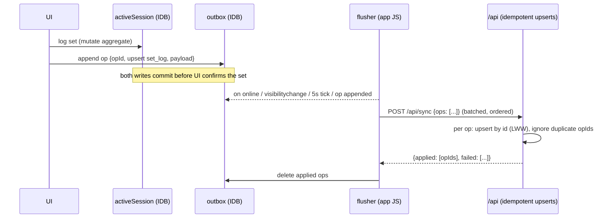

# PWA / Offline Strategy

Status: Final for MVP implementation. Companion: `adr/ADR-005-pwa-offline.md`.

Chosen posture: **online-first application, local-first active workout.** Not a general offline app, not a CRDT sync engine — the smallest architecture that makes gym logging bulletproof.

---

## 1. The one non-negotiable requirement

> A set logged in the gym must never be lost — not to dead Wi-Fi, not to a refresh, not to iOS killing the backgrounded browser, not to closing the tab.

Everything else (browsing history offline, editing templates offline) is explicitly *not* required and *not* built.

## 2. Explicit offline capability matrix

| Capability | Offline? | How |
|---|---|---|
| Open the app (installed PWA) | ✅ | Service worker precaches app shell |
| See Today screen for the active block | ✅ | Bundle cached at last online load |
| Start today's scheduled workout | ✅ | From cached WorkoutContextBundle |
| Log / edit / delete sets, add ad-hoc exercise, skip, complete | ✅ | Local session store + outbox (works with zero connectivity) |
| See previous performance per exercise | ✅ | Included in bundle |
| See / accept / override pending recommendations | ✅ | In bundle; decision + (if completing offline) client-computed recs queue in outbox |
| Resume in-progress workout after refresh / crash / restart | ✅ | IndexedDB is the live store, not a backup |
| Browse full history, analytics, volume charts | ❌ | Online only (may serve stale HTTP cache opportunistically, no guarantee) |
| Edit programs / templates / blocks / exercises / presets | ❌ | Online only — avoids definition-level merge conflicts entirely |
| Log bodyweight / recovery | ✅ (lightweight) | Same outbox mechanism, trivial payloads |
| Login | ❌ | Requires network; see §7 auth expiry handling |

This split kills the hard problems: definitions (templates, exercises) are only ever edited online ⇒ the offline write surface is *append-mostly facts with client-generated UUIDs*, which sync trivially.

## 3. Storage layout (client)

IndexedDB (via `idb`), one database, three stores:

```text
activeSession   — the full in-progress session aggregate (session + exercises + sets),
                  written synchronously-in-flow on EVERY mutation (single small object; ~KBs)
outbox          — append-only queue of mutations: {opId (uuidv7), entity, op, payload, createdAt, tries}
bundleCache     — last WorkoutContextBundle + fetchedAt
```

- `localStorage` is not used for data (sync API, size limits, eviction behavior); only for trivial UI prefs.
- On app start: `navigator.storage.persist()` requested; installed iOS PWAs get durable storage, and the outbox flushes promptly anyway, so the at-risk window is minutes, not days.

## 4. WorkoutContextBundle

One GET endpoint (`/api/today-bundle`) returns everything needed to run today's workout without further network:

```text
{ activeProgram, activeBlock {…, weekIndex, isDeload, weekOverrides},
  todayTemplate + effective prescriptions (modifiers applied),
  perExercise: { previousPerformance (last 3 non-deload), pendingRecommendation?,
                 history for engine (last 5) },
  exercises metadata (loadStepKg…), generatedAt }
```

Fetched on every Today screen load while online; cached in `bundleCache`. Staleness is acceptable and displayed ("as of 07:41"). The bundle includes engine history so an offline completion can compute recommendations locally with the same pure domain code.

## 5. Write path (always the same, online or not)



Key properties:

- **Local write is the source of UI truth** during a session; server confirmation is invisible bookkeeping. Logging works identically with airplane mode on.
- **Idempotency:** every op carries a client `opId`; the server keeps a short-lived `applied_ops` memory (or relies on natural idempotency of id-keyed upserts — chosen approach: natural idempotency; ops are full-row upserts/deletes keyed by entity UUID, so replays converge). Retries are safe.
- **Ordering:** outbox flushes FIFO in one batch per request; parent-before-child ordering is guaranteed by append order (session created before its sets).
- **Backoff:** on failure, exponential backoff with jitter, capped at 60s; the queue survives restarts.
- Server records `created_at/updated_at` as receipt times and trusts client `logged_at/started_at` as event times (documented clock-skew stance: client clocks are honest for a personal app).

## 6. Conflict policy (deliberately simple)

- Single user, and in practice a single actively-logging device; the DB enforces one `in_progress` session globally (`uq_sessions_one_in_progress`).
- Sync applies **last-write-wins at row granularity** by arrival order. No vector clocks, no merge UI. With the offline write surface limited to session facts this cannot corrupt definitions, and realistic conflicts (same set edited on two devices while both offline) are accepted as vanishingly rare for MVP.
- Starting a workout on device B while device A holds an in-progress session: server rejects the second `create session` op; client B surfaces "Workout in progress on another device — resume (view cached) or take over (discards other)?" Takeover = explicit user action that discards the stale session. No silent merging.
- If a sync op is *rejected* (validation, FK) rather than failed (network): the op moves to a dead-letter list shown in a "sync issues" screen with payload preserved — never silently dropped. Expected to be rare enough that this screen is essentially never seen.

## 7. Auth interaction

- Session cookie: 30-day rolling expiry (`adr/ADR-004-authentication.md`) — re-login at the gym should essentially never happen.
- If the cookie has expired when the flusher runs: ops **stay queued**, UI shows a persistent "sign in to sync" pill; nothing is lost, logging continues locally. Login (online, later) resumes the flush.
- The service worker never caches API responses containing data beyond the bundle mechanism; the cached bundle lives in IndexedDB under the same origin protections as everything else.

## 8. Service worker & installability

- **Tooling:** Serwist (Next.js integration) with `injectManifest` — precache app shell: route chunks for Today / Active Workout / login, framework assets, fonts, icons.
- **Runtime caching:** `NetworkFirst` (3s timeout → cache) for `/api/today-bundle` GET as a second safety net under the IndexedDB bundle; `CacheFirst` for immutable hashed assets. **No caching of other API GETs in MVP** (stale-data complexity without a requirement).
- **Navigation fallback:** offline navigation resolves to the precached shell, which boots the client router; Today/Workout routes are client components rendering from IndexedDB.
- **Update flow:** new SW installs in background → "Update ready" toast → applies on next natural navigation or explicit tap (`skipWaiting` only on user action, never mid-workout).
- **Manifest:** `display: standalone`, portrait, theme/background colors, maskable icons, `apple-touch-icon`, iOS meta tags (`apple-mobile-web-app-capable`, status-bar style), `viewport-fit=cover` + safe-area CSS.

## 9. iOS-specific constraints accounted for

| iOS reality | Consequence in this design |
|---|---|
| No Background Sync / Periodic Sync API | Flush triggers are foreground-only: app open, `online`, `visibilitychange`, timer, post-mutation. Acceptable: syncing happens next time the app is opened. |
| WebKit may kill backgrounded PWAs freely | Active session lives in IndexedDB from the first tap; process death loses zero data; reopen → auto-resume. |
| 7-day storage eviction for *browser-tab* usage | Primary usage is the installed PWA (exempt in practice); `storage.persist()` requested; outbox drains promptly, server holds everything ≥ minutes old. |
| Cookies persist in installed PWAs; no push (not needed) | Long-lived cookie auth is fine; no notification features in MVP. |
| One "tab" in standalone mode | No multi-tab IndexedDB write races in practice; a `navigator.locks` guard around the flusher is a cheap belt-and-braces addition. |
| Home-screen icon/splash quirks | Standard apple-touch-icon + splash generation task in Phase 8. |

## 10. Crash/refresh recovery walkthrough (acceptance behavior)

1. User logs set 3 of Bench — IndexedDB commit → UI confirms (<50ms).
2. iOS kills the app in the background between sets.
3. User reopens from Home Screen: shell boots offline, `activeSession` found → "Resume Push A — 3 sets logged, started 18:42" → one tap, back at set 4 with rest timer state rebuilt from `logged_at`.
4. Connectivity returns at any later point → outbox drains → server state converges. If the user instead finished offline: completion op + client-computed recommendations are in the queue and land whenever sync happens.

## 11. What was deliberately not built (and why)

- **Full local-first with a sync engine (Replicache / PowerSync / ElectricSQL / CRDTs):** solves multi-writer replication we don't have; adds a vendor/protocol to a single-user app; violates "boring" (ADR-005 alternatives).
- **Offline template editing:** would drag definitions into conflict-resolution scope for zero gym-floor value.
- **Offline-complete history browsing:** nice-to-have; the bundle covers the actual in-gym need (previous performance per today's exercises).
- **Web Push / background anything:** unsupported-or-irrelevant on the target platform for MVP.

## 12. Testing requirements (Phase 8 acceptance)

- Playwright with offline network emulation: start workout online → go offline → log 10 sets → refresh → resume → complete → go online → assert server rows converge (ids, values, order) and recommendations exist.
- Kill-and-restore: seed `activeSession` + outbox fixtures → fresh page load → resume path renders identical state.
- Duplicate-flush test: replay the same op batch twice → server state identical (idempotency).
- Expired-cookie flush → ops retained, UI pill shown, post-login drain succeeds.
