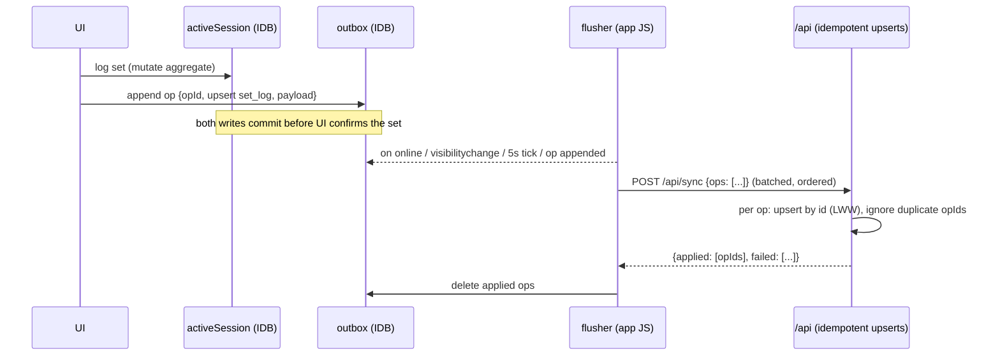

# PWA / Offline Strategy

Status: Final for MVP implementation. Companion: `adr/ADR-005-pwa-offline.md`.

Chosen posture: **online-first application, local-first active workout.** Not a general offline app, not a CRDT sync engine — the smallest architecture that makes gym logging bulletproof.

---

## 1. The one non-negotiable requirement

> A set logged in the gym must never be lost — not to dead Wi-Fi, not to a refresh, not to iOS killing the backgrounded browser, not to closing the tab.

Everything else (browsing history offline, editing templates offline) is explicitly *not* required and *not* built.

## 2. Explicit offline capability matrix

| Capability | Offline? | How |
|---|---|---|
| Open the app (installed PWA) | ✅ | Service worker precaches app shell |
| See Today screen for the active block | ✅ | Bundle cached at last online load |
| Start today's scheduled workout | ✅ | From cached WorkoutContextBundle |
| Log / edit / delete sets, add ad-hoc exercise, skip, complete — any measurement profile | ✅ | Local session store + outbox (works with zero connectivity); profile-scoped full-row emission (O-13, athletic-measurement-profiles §24.2) — a `duration` / `load_distance` / `distance_time` / `load_duration` set logs offline exactly like `load_reps`, with no reduced offline capability by profile |
| See previous performance per exercise | ✅ | Included in bundle |
| See / accept / override pending recommendations | ✅ | In bundle; decision + (if completing offline) client-computed recs queue in outbox |
| Resume in-progress workout after refresh / crash / restart | ✅ | IndexedDB is the live store, not a backup |
| Browse full history, analytics, volume charts | ❌ | Online only (may serve stale HTTP cache opportunistically, no guarantee) |
| View the Metrics dashboard (`/metrics`) | ❌ | Online only — `GET /api/metrics` is `NetworkOnly`; no IndexedDB store, no bundle field, no cache across launches |
| Edit the Metrics dashboard's exercise selection (`/metrics/exercises`) | ❌ | Online only — `GET`/`PUT /api/metrics/selection` are `NetworkOnly`; never queued in the outbox |
| Edit programs / templates / blocks / exercises / presets | ❌ | Online only — avoids definition-level merge conflicts entirely |
| Log bodyweight / recovery | ✅ (lightweight) | Same outbox mechanism, trivial payloads |
| Login | ❌ | Requires network; see §7 auth expiry handling |

This split kills the hard problems: definitions (templates, exercises) are only ever edited online ⇒ the offline write surface is *append-mostly facts with client-generated UUIDs*, which sync trivially.

## 3. Storage layout (client)

IndexedDB (via `idb`), one database, three stores:

```text
activeSession   — the full in-progress session aggregate (session + exercises + sets),
                  written synchronously-in-flow on EVERY mutation (single small object; ~KBs)
outbox          — append-only queue of mutations: {opId (uuidv7), entity, op, payload, createdAt, tries}
bundleCache     — last WorkoutContextBundle + fetchedAt
```

- `localStorage` is not used for data (sync API, size limits, eviction behavior); only for trivial UI prefs.
- On app start: `navigator.storage.persist()` requested; installed iOS PWAs get durable storage, and the outbox flushes promptly anyway, so the at-risk window is minutes, not days.

## 4. WorkoutContextBundle

One GET endpoint (`/api/today-bundle`) returns everything needed to run today's workout without further network:

```text
{ activeProgram, activeBlock {…, weekIndex, isDeload, weekOverrides},
  todayTemplate + effective prescriptions (modifiers applied,
                  incl. restSeconds and the slot's prescriptionNotes),
  perExercise: { previousPerformance (last 3 non-deload), pendingRecommendation?,
                 history for engine (last 5) },
  exercises metadata (loadStepKg…), generatedAt }
```

Fetched on every Today screen load while online; cached in `bundleCache`. Staleness is acceptable and displayed ("as of 07:41"). The bundle includes engine history so an offline completion can compute recommendations locally with the same pure domain code.

Every **new** bundle field is optional on the client mirror (`TodayBundleExerciseEntryDto` in `src/sync/types.ts`) even where the server type declares it required — `prescriptionNotes` (PI-018) follows `warmupRoutines` and `measurement` here. Both the service worker's `today-bundle` cache and the IndexedDB `bundleCache` keep serving pre-upgrade copies after a deploy, which have no such key at all, so every read site must handle absence at compile time; the Phase 5 L-4 regression (a cached bundle lacking `appliedModifiers` made offline start throw) is what assuming otherwise costs. Absence means "nothing to show", never an error, and is never backfilled from current program data.

**Set Groups Stage A (`set-groups-architecture-evaluation.md`) additive bundle keys.** `pendingRecommendation` (singular, null-key) is unchanged; a `groups`-scheme entry additionally carries `groupPrefills?: Record<key, {loadKg, reps}>` (mirroring the snapshot) and `pendingRecommendations?: RecommendationDto[]` (one entry per group with a pending record, filtered to keys present in the current scheme — a removed group's pending record is never surfaced — with the first group falling back to a pre-conversion null-key record). Same optional-on-the-client-mirror tolerance as every other additive bundle key: a bundle cached before this release has neither, and `startSession` freezes exactly what the bundle entry carries, nothing more. **A history set embedded in the bundle (`HistorySetSummaryDto`) also gains an optional `groupKey`** — needed by the offline client's own per-group evaluation fallback (`buildClientRecommendationOps`, §5); a bundle cached before this release has none, so every group's history is empty for an offline completion until the next successful bundle fetch (self-healing, the same "cached bundle lacks a new field" class every additive bundle key has had).

## 5. Write path (always the same, online or not)



Key properties:

- **Local write is the source of UI truth** during a session; server confirmation is invisible bookkeeping. Logging works identically with airplane mode on.
- **Idempotency:** every op carries a client `opId`; the server keeps a short-lived `applied_ops` memory (or relies on natural idempotency of id-keyed upserts — chosen approach: natural idempotency; ops are full-row upserts/deletes keyed by entity UUID, so replays converge). Retries are safe.
- **Ordering:** outbox flushes FIFO in one batch per request; parent-before-child ordering is guaranteed by append order (session created before its sets).
- **Backoff:** on failure, exponential backoff with jitter, capped at 60s; the queue survives restarts.
- Server records `created_at/updated_at` as receipt times and trusts client `logged_at/started_at` as event times (documented clock-skew stance: client clocks are honest for a personal app).

**Profile-scoped full-row emission (O-13, athletic measurement profiles).** A `setLog` full-row op (and the renumber upserts) emits the profile-independent keys plus **every key the slot's frozen `measurement_profile` permits** — required and optional, `null` for an absent optional value — and omits every key the profile forbids; for `load_reps` this is byte-identical to today's fixed key set. `workoutSessionFullRowOp` and `sessionExerciseFullRowOp` keep their complete, unconditional field lists (the latter's two new optional keys, `measurementProfile` and `loadBasis`, are **always** emitted so its key set stays fixed). **Server acceptance of the profile-scoped shape lands in Release 1; the client only emits it starting Release 2** — until then every emitted op is the existing `load_reps` shape regardless of what the server now accepts.

**`sessionExercise` insert comparison is profile-only, with `loadBasis` ignored (I-14).** The server derives a slot's `measurement_profile` / `load_basis` from the live exercise row (a user-scoped select) and compares **only** the payload's `measurementProfile` against it; a disagreement rejects `measurement_profile_mismatch`. The payload's `loadBasis` key is validated for shape but **never compared and never used** to derive the stored value — the slot's basis is always the exercise row's value at insert. The key still has to be present on every `sessionExercise` full-row op (above) purely so that builder's key set stays fixed; it carries no authority.

**Two new `SyncRejectReason` members**, both dead-letter reasons surfaced on the sync-issues screen exactly like existing members: `invalid_measurement` (a set op whose effective row violates its slot's frozen profile shape or a numeric bound, or a mapped `23514`/`22003`) and `measurement_profile_mismatch` (a `sessionExercise` insert whose payload `measurementProfile` disagrees with the derived exercise-row value). Neither changes the meaning of any existing member; `invalid_reference` continues to cover the composite-FK `23503` case.

**Two disclosed Release-1 seams (added 2026-09-07, `athletic-measurement-profiles-release-1-review.md` L-12); status updated below (2026-09-08, M-4 remediation).**

1. **Client active-session DTO — discharged.** The server's own `ActiveSessionSetDto` (`src/server/today/service.ts`) widened `weightKg`/`reps` to `number | null` for display, plus `distanceM`/`durationS`; the client's mirror (`src/sync/types.ts`) now carries the identical set-shape widening (`weightKg`/`reps: number | null`, plus `distanceM`/`durationS`), closed as part of this release's Foundations stage. The remaining gap this seam implied — the exercise-level `measurement` field was missing from the server's own `ActiveSessionExerciseDto`, so no client mirror could carry it either — was closed by this remediation's H-1 fix (`athletic-measurement-profiles-release-2-review.md` §5.1), which added `measurement: { profile: MeasurementProfile; loadBasis: LoadBasis | null }` to `ActiveSessionExerciseDto` on both the server (`src/server/today/service.ts`) and the client (`src/sync/types.ts`, frozen at `startSession` from the bundle entry and defaulted by `normalizeActiveSession` for pre-upgrade cached aggregates). Both halves of this seam are now closed; a non-`load_reps` active session renders its full row, cross-device, on both the server and client DTOs.
2. **`applySessionExerciseUpsert`'s update path does not re-derive `load_basis` on an `exerciseId` swap — still open, deliberately deferred.** §10.1/I-14 scope the user-scoped derivation to *insert* only. On update, a payload changing `exerciseId` to a different profile is refused by the mirror FK (`invalid_reference`, fails closed); a same-profile swap succeeds but leaves the slot's `load_basis` at its original, now-possibly-stale value. Release 2 unlocked the basis selector, making this reachable, but neither Release 2 nor its remediation addressed it: fixing it means touching `applySessionExerciseUpsert` in `src/server/sync/service.ts`, which this remediation's stage boundaries hold as a protected, must-not-change file (the independent review verified it as an empty diff). This seam is explicitly re-targeted, not dropped: it remains open and is a candidate for the next release that is permitted to touch `src/server/sync/service.ts`.

**Refused-op surfacing on the active session (O-16, Release 2).** The blocked/banner mechanism (§10, `refreshSessionBlocked`) is extended additively to cover `setLog` and `sessionExercise` dead letters, not only `workoutSession` dead letters: a rejected op whose `payload.sessionExerciseId` / `payload.sessionId` matches the active session marks that set or slot "Not saved — see Sync issues" on the card and raises the existing banner. Completion stays possible; the completion confirm additionally warns that unsaved sets will be dropped from the aggregate. This is the mechanism `invalid_measurement` and `measurement_profile_mismatch` (§5 above) surface through once Release 2 unlocks profile-aware logging — a rejected profile-scoped op is never a silent loss.

**Set Groups Stage A — group-scoped emission, validation, and rollback.** Following the identical O-13 profile-scoped pattern above: `setLog.groupKey`, `recommendation.groupKey`, and the client-computed recommendation op's `inputs.prescribed.group`/`inputs.extraWorkSets` are emitted **only** for a grouped slot / per-group record, omitted entirely (not `undefined`, not `null`, not `[]`) for an ungrouped one — an ungrouped op stays byte-identical to before Stage A. A work set's `groupKey` is validated server-side against the parent slot's **frozen snapshot** group keys (the same idiom `dimensionsOf(parentProfile)` already uses for measured fields): `null`/absent on an ungrouped slot, one of the frozen scheme's keys on a grouped one, rejected `invalid_payload` otherwise. **Old client, new bundle:** an old build's schema fails closed on `scheme.type: "groups"` inside the session-exercise upsert payload, before `commitSessionMutation` — "Start workout" throws cleanly, no orphaned local session (the same exposure the athletic-measurement-profiles release already accepted; mitigate operationally by updating every used client first). **New client, rolled-back server:** the old server rejects the grouped slot's `sessionExercise` op outright (unknown discriminator fails the union), so that row never exists server-side and every `setLog` op for it is then rejected `not_found` — the **whole grouped slot, including its sets, is absent server-side**, not just the grouping. Nothing is deleted locally: each rejected op keeps its payload in the outbox, listed on the Sync issues screen, retryable unaltered once the server rolls forward (retry re-queues at the original FIFO position, so retrying in creation order preserves parent-before-children). Operational rule: do not roll back while a grouped session may be in flight; if a rollback happens, roll forward before discarding any dead letters.

## 6. Conflict policy (deliberately simple)

- Single user, and in practice a single actively-logging device; the DB enforces one `in_progress` session globally (`uq_sessions_one_in_progress`).
- Sync applies **last-write-wins at row granularity** by arrival order. No vector clocks, no merge UI. With the offline write surface limited to session facts this cannot corrupt definitions, and realistic conflicts (same set edited on two devices while both offline) are accepted as vanishingly rare for MVP.
- Starting a workout on device B while device A holds an in-progress session: server rejects the second `create session` op; client B surfaces "Workout in progress on another device — resume (view cached) or take over (discards other)?" Takeover = explicit user action that discards the stale session. No silent merging.
- If a sync op is *rejected* (validation, FK) rather than failed (network): the op moves to a dead-letter list shown in a "sync issues" screen with payload preserved — never silently dropped. Expected to be rare enough that this screen is essentially never seen.

## 7. Auth interaction

- Session cookie: 30-day rolling expiry (`adr/ADR-004-authentication.md`) — re-login at the gym should essentially never happen.
- If the cookie has expired when the flusher runs: ops **stay queued**, UI shows a persistent "sign in to sync" pill; nothing is lost, logging continues locally. Login (online, later) resumes the flush.
- The service worker never caches API responses containing data beyond the bundle mechanism; the cached bundle lives in IndexedDB under the same origin protections as everything else.

## 8. Service worker & installability

- **Tooling:** Serwist (Next.js integration) with `injectManifest` — precache app shell: route chunks for Today / Active Workout / login, framework assets, fonts, icons.
- **Runtime caching:** `NetworkFirst` (3s timeout → cache) for `/api/today-bundle` GET as a second safety net under the IndexedDB bundle; `CacheFirst` for immutable hashed assets. **No caching of other API GETs in MVP** (stale-data complexity without a requirement).
- **Navigation fallback:** offline navigation resolves to the precached shell, which boots the client router; Today/Workout routes are client components rendering from IndexedDB.
- **Update flow:** new SW installs in background → "Update ready" toast → applies on next natural navigation or explicit tap (`skipWaiting` only on user action, never mid-workout).
- **Manifest:** `display: standalone`, portrait, theme/background colors, maskable icons, `apple-touch-icon`, iOS meta tags (`apple-mobile-web-app-capable`, status-bar style), `viewport-fit=cover` + safe-area CSS.

## 9. iOS-specific constraints accounted for

| iOS reality | Consequence in this design |
|---|---|
| No Background Sync / Periodic Sync API | Flush triggers are foreground-only: app open, `online`, `visibilitychange`, timer, post-mutation. Acceptable: syncing happens next time the app is opened. |
| WebKit may kill backgrounded PWAs freely | Active session lives in IndexedDB from the first tap; process death loses zero data; reopen → auto-resume. |
| 7-day storage eviction for *browser-tab* usage | Primary usage is the installed PWA (exempt in practice); `storage.persist()` requested; outbox drains promptly, server holds everything ≥ minutes old. |
| Cookies persist in installed PWAs; no push (not needed) | Long-lived cookie auth is fine; no notification features in MVP. |
| One "tab" in standalone mode | No multi-tab IndexedDB write races in practice; a `navigator.locks` guard around the flusher is a cheap belt-and-braces addition. |
| Home-screen icon/splash quirks | Standard apple-touch-icon + splash generation task in Phase 8. |

## 10. Crash/refresh recovery walkthrough (acceptance behavior)

1. User logs set 3 of Bench — IndexedDB commit → UI confirms (<50ms).
2. iOS kills the app in the background between sets.
3. User reopens from Home Screen: shell boots offline, `activeSession` found → "Resume Push A — 3 sets logged, started 18:42" → one tap, back at set 4 with rest timer state rebuilt from `logged_at`.
4. Connectivity returns at any later point → outbox drains → server state converges. If the user instead finished offline: completion op + client-computed recommendations are in the queue and land whenever sync happens.

## 11. What was deliberately not built (and why)

- **Full local-first with a sync engine (Replicache / PowerSync / ElectricSQL / CRDTs):** solves multi-writer replication we don't have; adds a vendor/protocol to a single-user app; violates "boring" (ADR-005 alternatives).
- **Offline template editing:** would drag definitions into conflict-resolution scope for zero gym-floor value.
- **Offline-complete history browsing:** nice-to-have; the bundle covers the actual in-gym need (previous performance per today's exercises).
- **Web Push / background anything:** unsupported-or-irrelevant on the target platform for MVP.

## 12. Testing requirements (Phase 8 acceptance)

- Playwright with offline network emulation: start workout online → go offline → log 10 sets → refresh → resume → complete → go online → assert server rows converge (ids, values, order) and recommendations exist.
- Kill-and-restore: seed `activeSession` + outbox fixtures → fresh page load → resume path renders identical state.
- Duplicate-flush test: replay the same op batch twice → server state identical (idempotency).
- Expired-cookie flush → ops retained, UI pill shown, post-login drain succeeds.
